# Mac OS X安装之硬盘和光盘引导总结

### 发布于2013-12-03 11:00

继上一篇虚拟机环境下的安装，这篇文档主要描述硬盘和光盘引导安装Mac OS X，并可实现多操作系统。

硬盘安装：

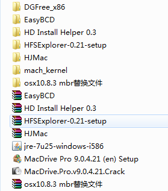

## 硬盘安装需要用到的软件

1. Java虚拟机。作为HFSExplorer的运行前提环境。
2. HFSExplorer。这款软件用来剥离dmg、cdr格式的OS X的安装程序的引导层。
3. HD Install Helper。其实就是Leopard硬盘安装助手。用来将HFSExplorer生成的操作系统镜像文件写入自己分配好的硬盘引导区域。
4. MacDrive。该软件可让Windows用户查看苹果的HFS+磁盘的文件。
5. DGFree。也就是DiskGenius。用来查看和管理磁盘的工具，例如查看磁盘信息详细、格式化磁盘、修改分区标示符、修改盘符等。
6. Mach_kernel和mbr替换文件。用于破解正式版安装程序的内核文件。
7. HJMac。用于引导启动多系统选择界面。
8. EasyBCD。加载和设置多系统选择项。
 

## 在安装之前，还有一些准备

1. 在BIOS中开启硬盘AHIC模式和硬件DPE（数据保护执行）
2. 尽量下载懒人版的操作系统，避免繁琐的成功率低的内核破解
3. 做好安装失败的心理准备，毕竟操作系统与硬件的兼容问题很麻烦，耐心折腾吧
 

## 安装步骤

### 准备硬盘分区

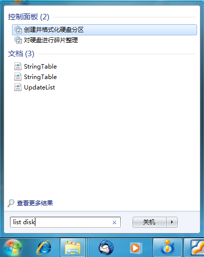
 
点击“开始”，搜索“list disk”，确定，出现磁盘管理界面

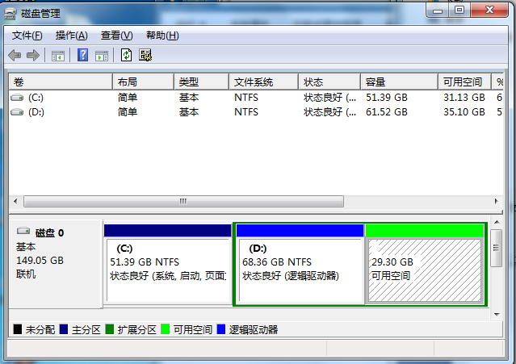

右键有空余空间的磁盘，最好可用空间大于30G。我这里选择D盘。

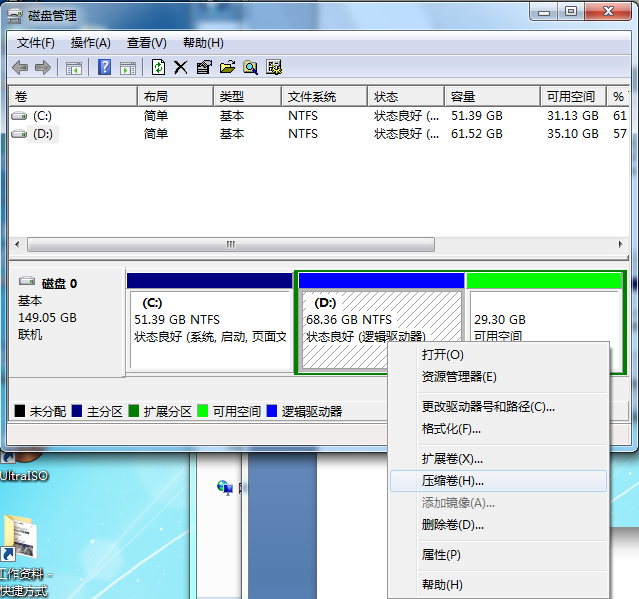

选择压缩卷。

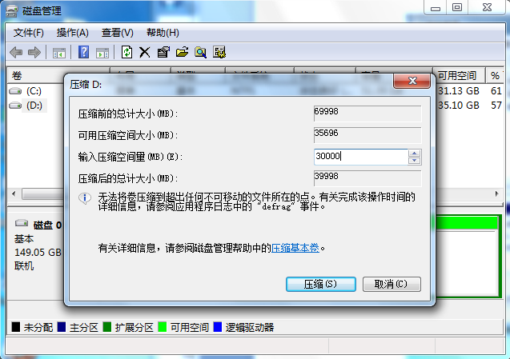 

输入压缩空间量3000MB（约30G）。（说明：这个空间量根据操作系统来分配。比如分配30G空间，操作系统为6G，那么假设用一个7G的空间来放操作系统的引导程序，则有23G空间来正式的安装操作系统。具体分配根据自己的需要。）

再将分出来的压缩卷，新建简单卷

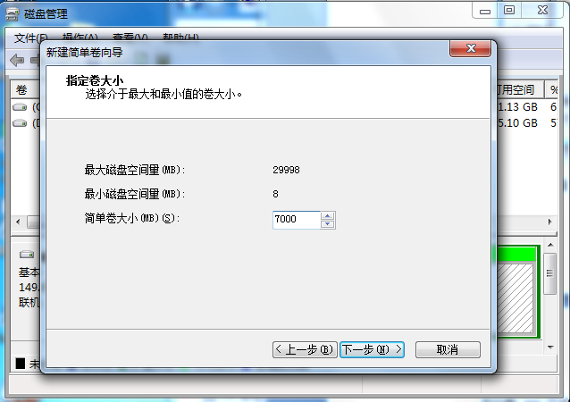

特别注意这一步，不要格式化。而且在后面的提示也不要格式化。

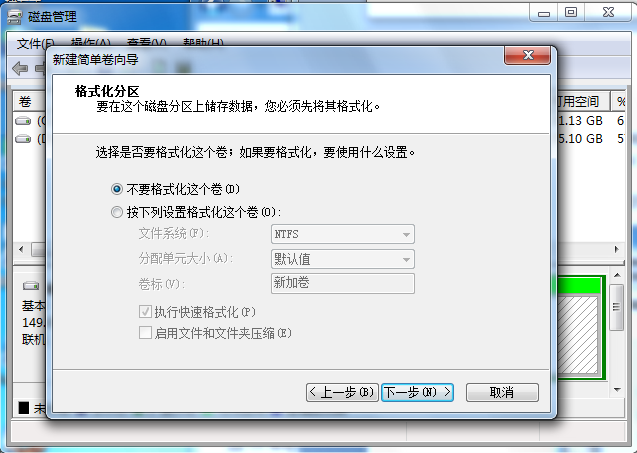

同样的步骤，将剩余的空间也新建简单卷。结果如下：

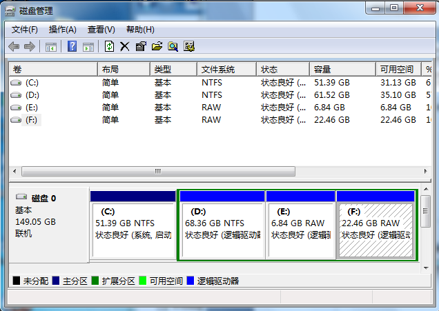

### 接下来剥离操作系统镜像的引导层

安装并打开HFSExplorer。前提是安装了Java虚拟机。选择Load file system from file

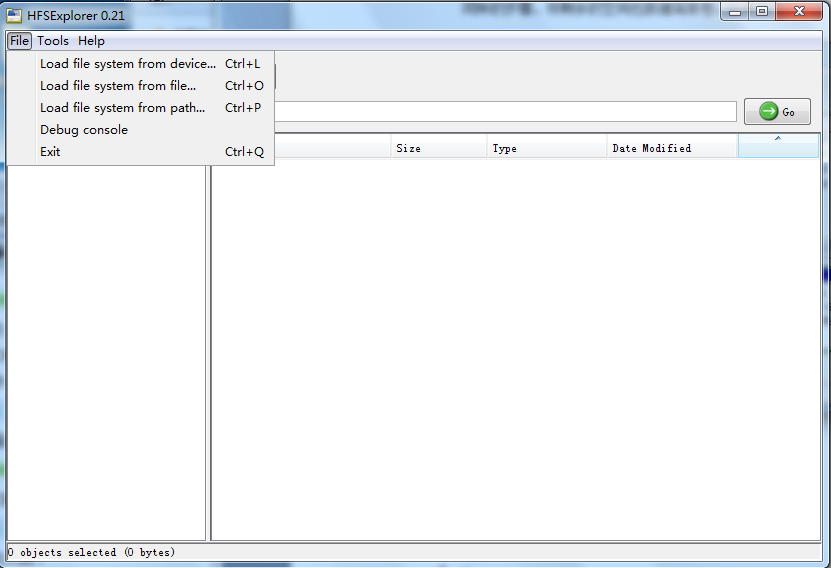

我这里是选择操作系统dmg镜像文件。（还有cdr格式的镜像文件也可以）

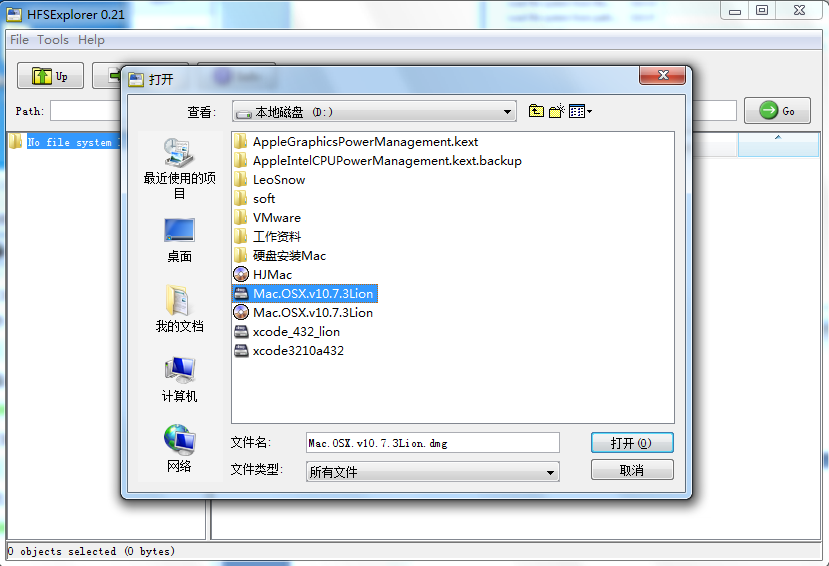

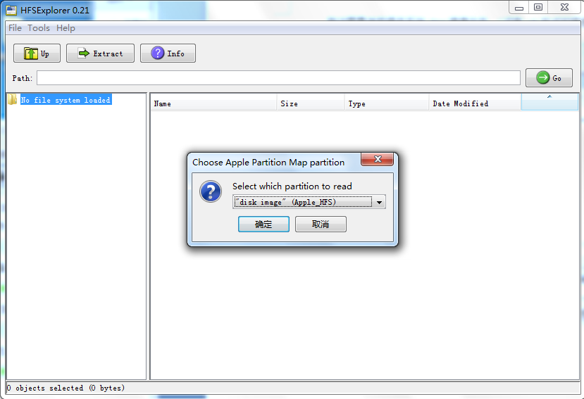

确定以后，Tools—>Create disk image。确定后，等待生成磁盘引导用dmg文件。

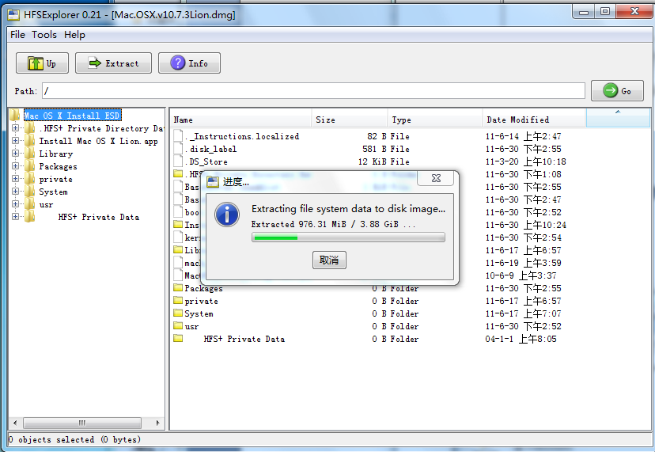

### 将dmg镜像写入系统引导磁盘分区

运行Leopard硬盘安装助手，打开刚生成的镜像文件，并选择目标分区（我这里是分配好的约7G的E盘）。注意去掉三个已勾选项。等待进度条读完（可能出现假死状态，请耐心等待）。

按照我的经历来说，出现上面的成功画面很难得。多数时候是“Change partition type to AF：Failed”。不过没有关系，系统文件应该是写入了对应分区，只是没有将分区的标识符改为AF（AF为OS X磁盘的标识符）。如果出现这情况，那需要手动按照如下方式修改：

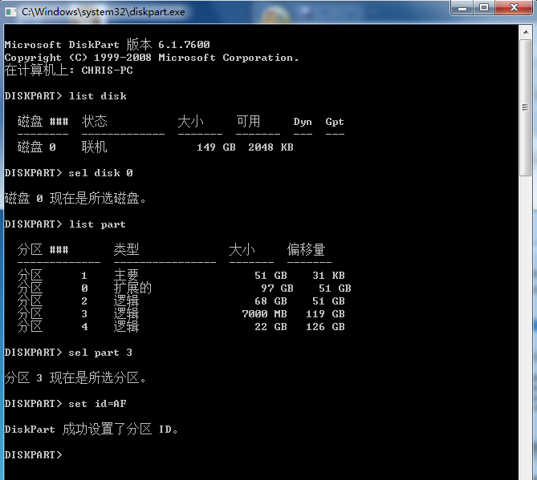

也可以用到前面提到的DiskGenius工具软件修改，或者进行其他操作。

### 查看HFS格式磁盘

在Windows下，是无法直接查看HFS格式的磁盘的，因为刚才写入操作系统时候，已经将7G的分区改为了HFS格式。所以需要借助McDrive来查看。我这里是McDrive Pro 9，安装好先。应该可以看到如下情况：

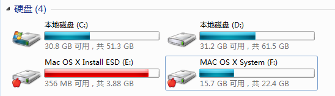

如果需要破解内核，可以直接找到对应目录文件进行文件覆盖。在此不多介绍。

### 准备多系统引导工作

将下载好的HJMac镜像文件直接放在非Windows系统盘的根目录下，我直接放在d盘下。

运行EasyBCD，选择“Add New Entry”，选择ISO Boot，输入Name，然后选择HJMac.iso文件，最后“Add Entry”。

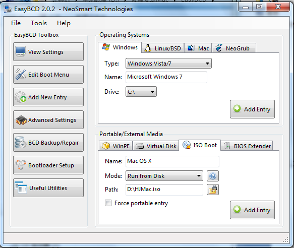

### 可以重启电脑了，然后选择“Mac OS X”，进入操作系统的安装

到此，硬盘的引导安装完成了，后面的安装过程与在虚拟机上的步骤一样。不过需要注意，这种安装方式存在驱动与硬件不兼容的问题，所以如何选择合适的驱动需要折腾很久，不断的重启电脑是家常便饭。

同样会遇到其他问题，例如操作系统镜像有问题，BIOS里的设置不正确等等。但是基本的步骤就是这样，当然，引导程序也可以用变色龙或者BootThink之类的，只有自己多尝试了。

 

 

## 光盘安装

这种方式算是最简单的方式了。

你需要做的事情，就是将硬盘安装步骤中，生成的磁盘引导安装dmg镜像，用刻录软件刻成系统安装盘，然后用光驱引导即可。

这个过程中，也会遇到很多兼容性问题，毕竟直接在组装机上安装，难度比较大。

那么，接下来的工作便需要各位在自己的pc机上不断尝试了。