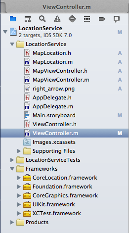
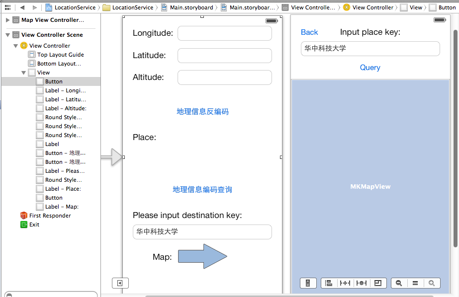
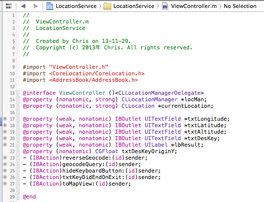
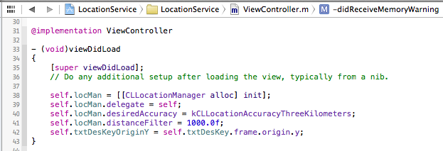
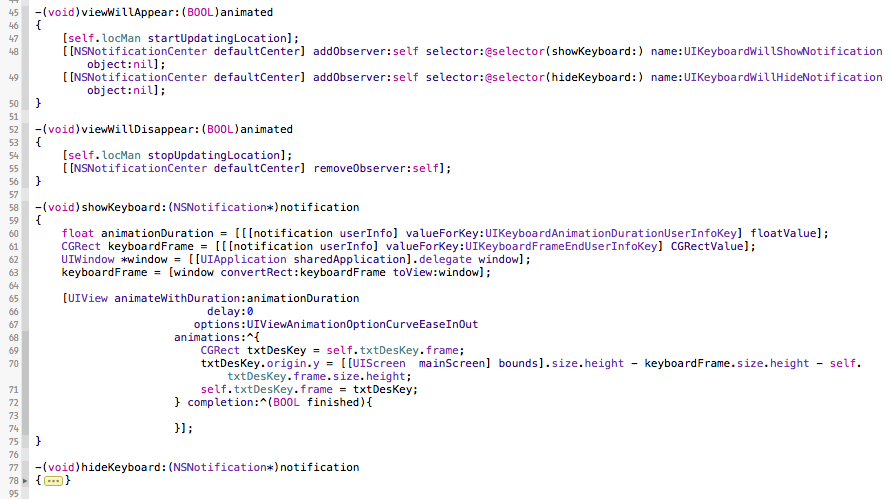
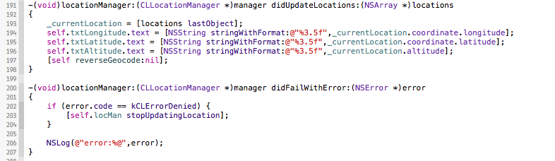
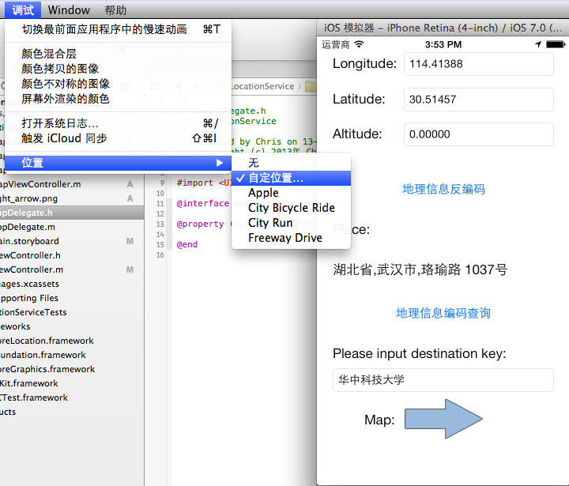
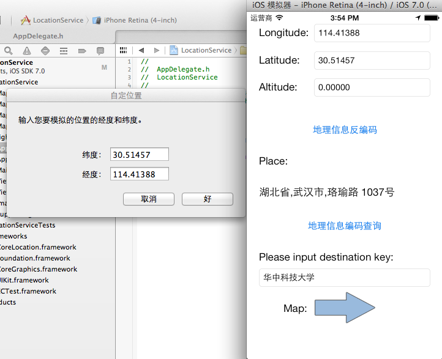
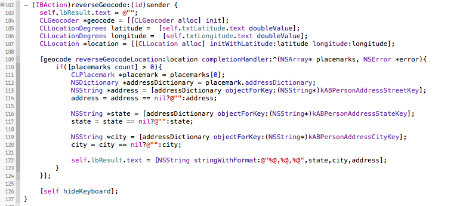

# Push Notification总结系列之移动客户端定位服务

### 发布于2013-12-04 16:49

## Notification系列概括
1. Push Notification简介和证书说明及生成配置
2. Push Notification的iOS处理代码和Provider详解
3. Push Notification的移动客户端定位服务

继上一篇文档后，消息推送功能基本可以实现了。这篇的内容主要是总结一下iOS的定位服务功能，再与消息推送功能结合，满足更丰富的推送体验。

## 定位服务的基础概念

### iOS设备定位服务

iOS设备提供了3种不同的途径进行定位：Wi-Fi、蜂窝式移动电话基站和GPS卫星。

GPS定位的优点是准确和覆盖面广，但是在建筑物里面不易收到GPS卫星信号，同时比较费电。蜂窝基站不仅误差比较大，而且会耗费用户较多流量。Wi-Fi定位是最经济实惠的。

iOS的定位服务编程不像Android系统可以指定采用哪种途径进行定位，因为API把底层这些细节屏蔽了，所以开发者和用户并不知道设备正在采用哪种方式定位，不过系统会采取最优方案，一般优先考虑GPS定位，其次为Wi-Fi，最后才会采用蜂窝基站定位。

### 编程使用的主要类

主要使用Core Location框架，定位时主要使用CLLocationManager、CLLocationManagerDelegate和CLLocation这3个类。

LLocationManager能够提供位置信息和高度信息，也可以监控设备进入或离开某个区域，还可以获得设备的运行方向。

CLLocationManagerDelegate是上述类的委托协议

CLLocation封装了位置和高度信息

如推送服务一样，在应用第一次安装后请求位置时，系统会自动提示用户。如果用户拒绝定位服务，最好有代码处理关闭定位服务，不然就算是侵犯了隐私权。

## 案例分析

下面结合我写的一个demo来具体说说：

这是我的demo文件目录。这里要介绍的主要内容在ViewController.m中。

### 新建一个定位服务的demo，需要添加CoreLocation.framework框架

上图是故事板的界面，做得比较简单，主要用来熟悉定位服务本身的。右边还有一个界面，是实现地图导航的，在此就不多介绍了。

这里是实现文件的属性，注意添加委托协议<CLLocationManagerDelegate>

初始化定位服务管理对象。

### 简要说明：

#### desiredAccuracy属性是用来确定定位精度的，共有6个常量

kCLLocationAccuracyNearestTenMeters

kCLLocationAccuracyHundredMeters

kCLLocationAccuracyKilometers

kCLLocationAccuracyThreeKilometers

kCLLocationAccuracyBest  设备使用电池供电时候最高的精度

kCLLocationAccuracyBestForNavigation 导航最高精度，一般在有外接电源时候才能使用。

精度越高，耗电越多，需要慎重调节定位精度。但是对于即刻定位后马上就关闭的情况，当然采用最高精度。

#### distanceFilter属性是距离过滤器

定义了设备移动多少距离才获取一次位置更新信息，单位是米。这样可以避免无谓的位置更新请求。

初始化后，需要开启和关闭更新位置信息，最好的代码位置就是viewWillAppear方法和viewWillDisappear里面。方法分别为：startUpdatingLocation和stopUpdatingLocation。这里是针对一直需要定位服务的本demo来说的。

上图中还有监听键盘显示和隐藏的通知和显示键盘的代码，目的是不遮挡地址关键字输入栏。隐藏键盘的时候，将地址关键字输入栏恢复到初始位置

这里是比较重要的委托方法。负责位置信息更新以后的代码处理。我的demo是将位置的经纬度和海拔显示到界面上，并进行地理信息反编码，得到位置的文字描述信息。

#### 错误处理方法

有判断更新失败的原因，如果为用户禁止，则关闭位置更新服务

我是在模拟器中运行，可以自定义位置经纬度，如图。

 
#### 地理信息反编码

 
#### 地理信息编码查询

相应的，也有地理信息编码查询，即是输入地址关键字，查询到详细地址和对应位置信息。如下图：

写到这里，定位服务的介绍和总结也结束了。了解了这个demo，我想和推送服务结合，获取目标用户的位置信息，应该也没有什么问题了。