# Push Notification简介和证书说明及生成配置

### 发布于2013-12-03 19:46

## Notification系列概括
1. Push Notification简介和证书说明及生成配置
2. Push Notification的iOS处理代码和Provider详解
3. Push Notification的移动客户端定位服务

## 远程推送通知概念

个人理解，指的是苹果公司通过服务器向设备终端推送信息的一种通知服务和功能。

### 对象

整个过程涉及四个对象，Your App（开发的应用），iOS（设备系统），APNS Server（Apple Push Notification Service Server苹果推送通知服务的服务器），Your Server（本地服务器，常称为Provider）。

### 流程

整个推送过程涉及的对象和流程如下图（借用了一张广为流传的图）：

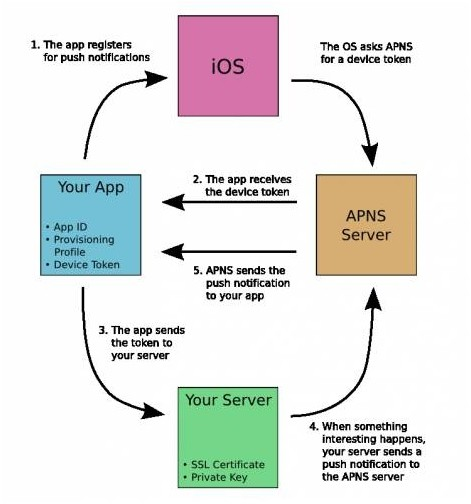

1. 应用程序注册消息推送。
2. iOS从APNS Server获取devicetoken，应用程序接收devicetoken。
3. 应用程序将devicetoken发送给PUSH服务端程序。
4. 服务端程序向APNS服务发送消息。
5. APNS服务将消息发送给iPhone应用程序。

### 关键词

AppID，ProvisioningProfile，DeviceToken，SSLCertificate，PrivateKey（请不要着急，看下文的证书说明和配置）

### 归纳

1. 应用程序通过设备向APNS注册，APNS返回设备和应用绑定生成的DeviceToken给应用程序 
2. 应用程序在收到DeviceToken以后，发送给本地服务器，可由本地服务器存储和管理
3. 本地服务器向APNS发送消息推送请求，APNS 根据请求中包含的证书信息和目标DeviceToken，找到已注册DeviceToken，并发送相应推送消息给应用程序

## 证书

这是作为一个苹果开发者首先要面对的问题。

个人理解，虽然与其他开发者相比，一开始折腾证书，会比较打击开发积极性，不过这确实是好东西。由于证书的存在，苹果开发者的权益才能得到保证，当然代价就是得付费，关于付费请查看开发者中心，说多了都是泪。

### 几个概念

1. AppID 应用ID。你的每个iOS应用都有一个唯一标识，如同每个人的身份证号码
2. Provisioning Profile 配置文件。包含了一系列的配置信息，例如开发版本或者发布版本
3. DeviceToken 设备令牌。标识安装有某应用的目标设备
4. SSL Certificate 带有推送服务的证书（后缀”也”为.cer），供Provider向APNS发送推送请求使用
5. Private Key 随证书一起存在

### 生成证书

提示：下文内容的前提是您已经在自己的开发者中心创建好了对应的AppID，添加好了用于测试的Devices（如果有需要的朋友，再说吧）

重点：创建的AppID名称不能带有通配符，否则不支持推送通知服务；并且配置里面需要开启PushNotification服务功能选项，有需要的，先去配置一下，或者重新创建吧

#### 1. 本地Mac机生成签名请求文件（.certSigningRequest）

启动钥匙串访问程序，点击钥匙图标

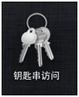

在菜单栏中依次选择:钥匙串访问⟶偏好设置⟶证书选项卡，下面两项全部选关闭

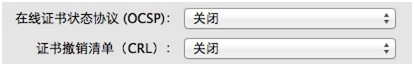

生成证书请求：钥匙串访问⟶证书助理⟶从证书颁发机构请求证书

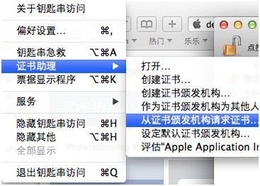

输入两个电子邮件地址和常用名称

a)  建议输入你在苹果网站注册的邮箱和名称，其他的也行，CA地址可以不填

b)  选择“存储到磁盘”和“让我指定钥匙对信息”。保存后的名称应该为：CertificateSigningRequest.certSigningRequest（这是第一个）

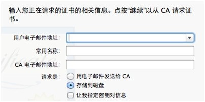

c)  保存到磁盘后在你的钥匙串访问窗口应该会出两个密钥，一个公钥密钥，一个专用密钥，红色部分就是你在上面输入的常用名。

 
#### 2. 在自己的开发者中心生成开发者证书（.cer文件）

现在可以回头看看推送图解的时候，SSL Certificate也是为.cer文件，但是二者是不同的。

开发者证书是为xcode提供的，分为开发版（Development）和发布版（Distribution），使App可以在真机上测试（使用开发版）以及最后的发布（使用发布版）；SSLCertificate是供推送服务的Provider使用的，当然也分上述两种，指定推送权限和目标设备及App。

首先请确认你已经在开发者中心并且已经为你的App创建好了AppID

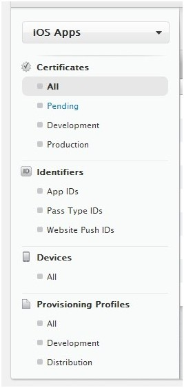

在Certificates中，为您的AppID创建新的证书（别说没有看到“+”这个加号），以开发者证书为例

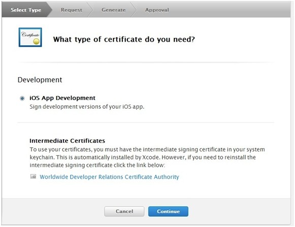

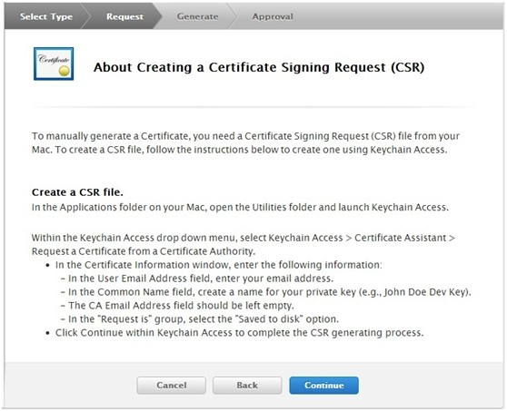

上图要求的CSR file正是我们之前生成的签名请求文件，直接继续

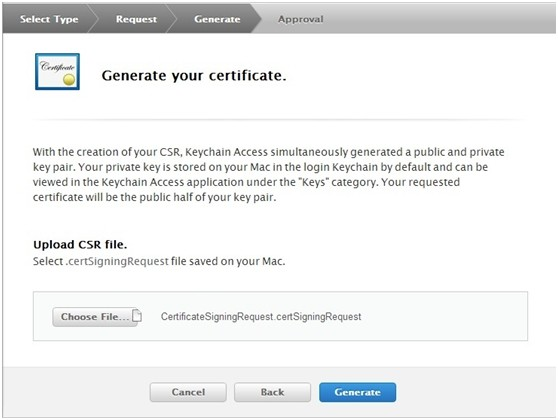

接下来，点生成，得到一个.cer证书文件（第二个），可以下载存储好

#### 3. 生成SSL Certificate 供Provider使用的推送通知证书

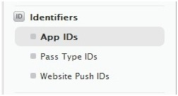

在AppID列表里，选择目标AppID，然后可以看到生成新证书的按钮

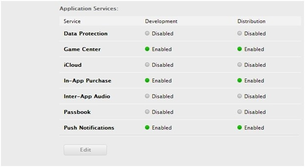

上图用的是公司的开发账号登陆，因为我的权限不足，看不到生成按钮。

直接下一步，然后选择开发者证书，选择设备，就可以生成目标文件了，最后下载，命名中最好带有apns之类的以示区别。

得到一个apns***.cer证书文件（第三个）

#### 4. ProvisioningProfiles配置文件生成

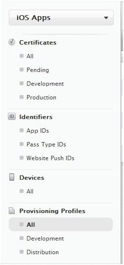

生成配置文件也是按照提示来就好，最后生成.mobileprovision文件（第四个）

至此，证书生成阶段完毕：

1. CertificateSigningRequest.certSigningRequest
2. 开发者证书.cer
3. Provider使用的SSL Certificate证书（带有apns命名的.cer）
4. .mobileprovision配置文件

## 本地Mac机配置

打开钥匙串访问程序，在如下界面，将开发者证书和推送通知用的证书一起添加进“登陆”文件列表

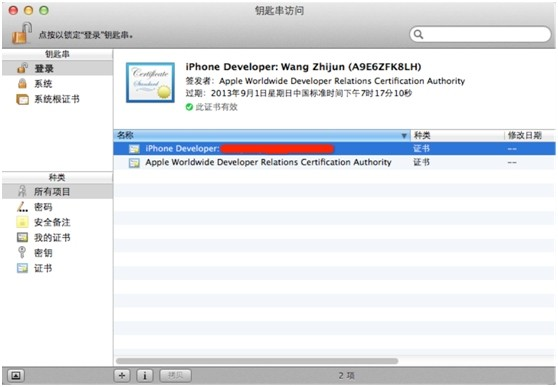

（借了一张图如上）

注意红色线遮挡的那个证书，应该是有一个Private Key跟随的。

特别是apns**.cer证书，需要有一个专用密钥（Private Key），才能右键生成.p12文件。

如上句所述，生成一个推送需要使用的.p12文件。

在此，说明一下，这里生成的p12文件是供Provider推送消息时使用，这是由我采用的推送方式决定。也还有其他推送方式，可以采用.pem等证书，甚至当采用Mac环境下的推送服务器时，可以直接使用apns**.cer文件，在此不谈论了。

将Xcode的Target证书配置选项，置为开发者证书，配置文件选项置为新生成的配置文件，即可在真机上测试后续的推送通知功能。

本篇介绍就到这里了，后续将介绍iOS推送通知代码和本地服务器Provider的实现。