# Mac OS X安装之虚拟机环境下的总结

### 发布于2013-12-03 10:43

最近一直忙着公司iOS Touch的新版发布，终于忙过了。

这个文档是我几个月前，开始配置苹果虚拟机时候，记录的资料。

一周以来，我都在摸索Mac OS X操作系统在非苹果机上的安装，由于是公司的组装机，存在与苹果操作系统的兼容性问题，而且一开始经理建议在硬盘上安装操作系统，所以折腾了一周多的时间。期间采用了硬盘引导安装，光盘引导安装，虚拟机安装等方法。

至此，安装工作顺利完成了，Xcode开发环境也已经配置好。

## 安装准备：

1. 组装机操作系统为64位Windows 7旗舰版。
虚拟机为VMware Workstation 9。
2. VMware Workstation破解安装Mac OS补丁：unlock-all 110
3. BIOS支持硬件虚拟化（Hardware Virtualization）和硬件数据执行保护（Hardware DEP），并且都为开启状态，务必首先开启，血的教训！需要开机进入BIOS设置为Enable状态。
4. 目标操作系统为Mac OS X 10.8.3的cdr安装文件。也可选择其他格式安装文件，例如dmg或者iso格式镜像。貌似有的版本安装会失败，我尝试过大概四个版本的安装程序.
5. VMware Tools工具，实现虚拟机的增强效果，例如全屏无黑边和鼠标在宿主机和虚拟机界面的自由移动。
 

## 开始安装：

### 安装虚拟机

### 安装破解补丁

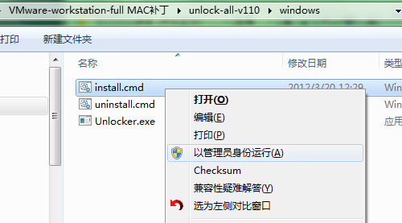

等待批处理文件自动运行完毕。

### 配置虚拟机

新建一个虚拟机

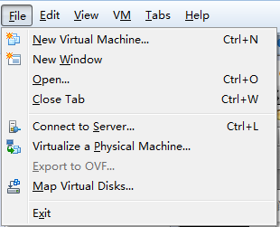

选择用户自定义模式

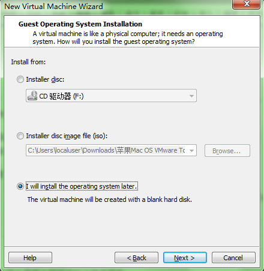

选择操作系统的时候，需要选择Apple Mac OS X。前提是必须先安装破解补丁。版本要选择与所安装的操作系统版本符合，这里为64位，故如下选择。

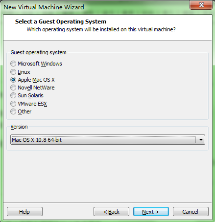

填入虚拟机名称和安装路径。

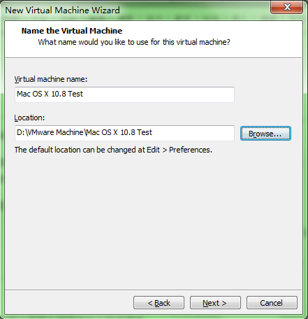

根据自己的需要选择cpu配置，分别为处理器个数和每个处理器的核数。

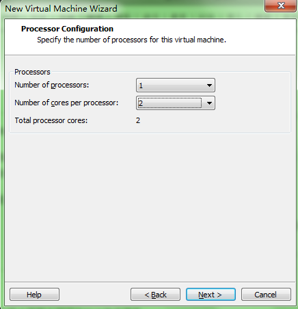

由于选择了64位操作系统，故内存至少为4G。

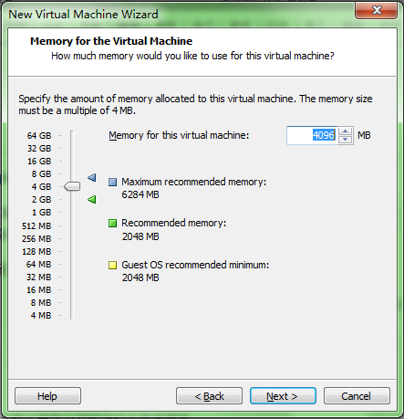

网络连接选择了桥接模式，由于公司内部采用ip与mac地址绑定的方式，故需要手动设置虚拟机IPv4地址。若为家庭网络，可选择NAT模式。

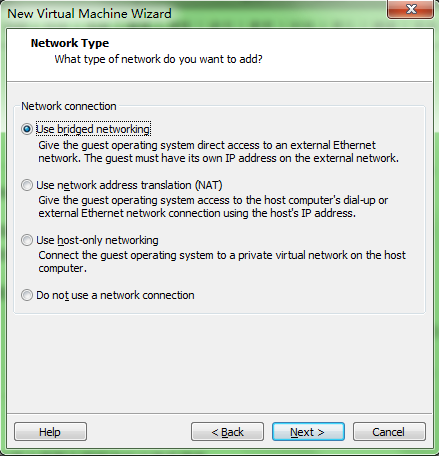

最大硬盘容量不低于推荐值。

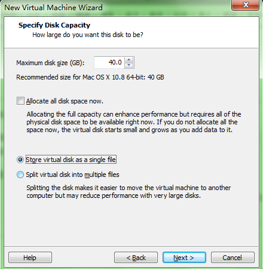

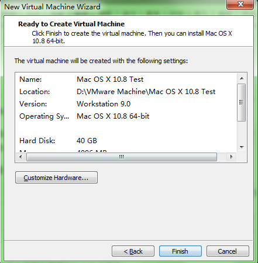

创建好虚拟机后，进入设置。

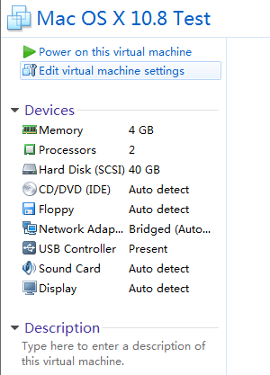

可将软驱删除（remove）。可能会因为软驱导致异常问题。

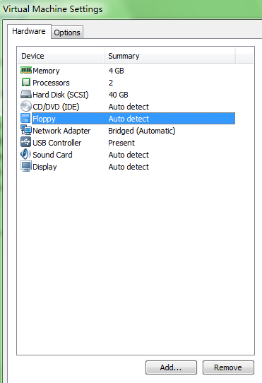

进入硬盘的高级设置（Advanced）。

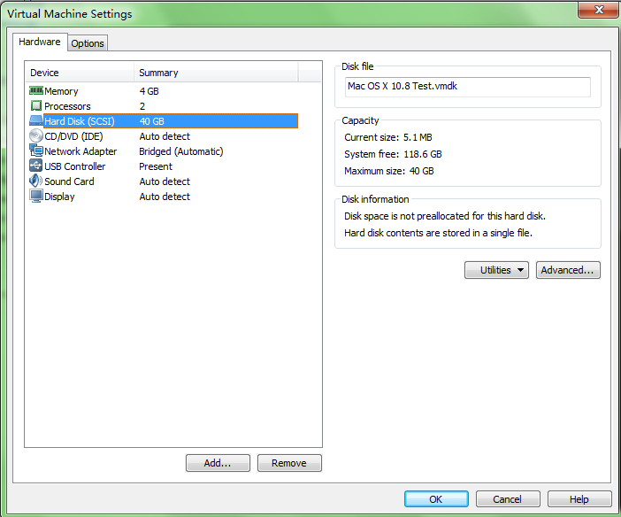

选择（0:8）。

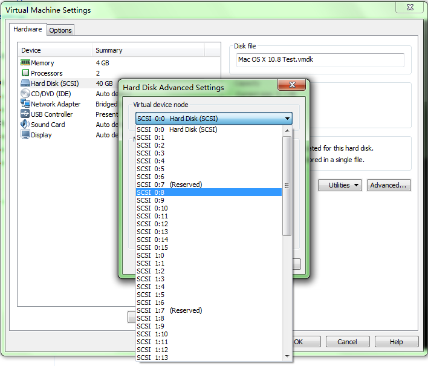

然后在光驱设置里，选择“Use ISO image file”，浏览时候选择所有文件类型，因为我采用的是cdr格式安装文件。

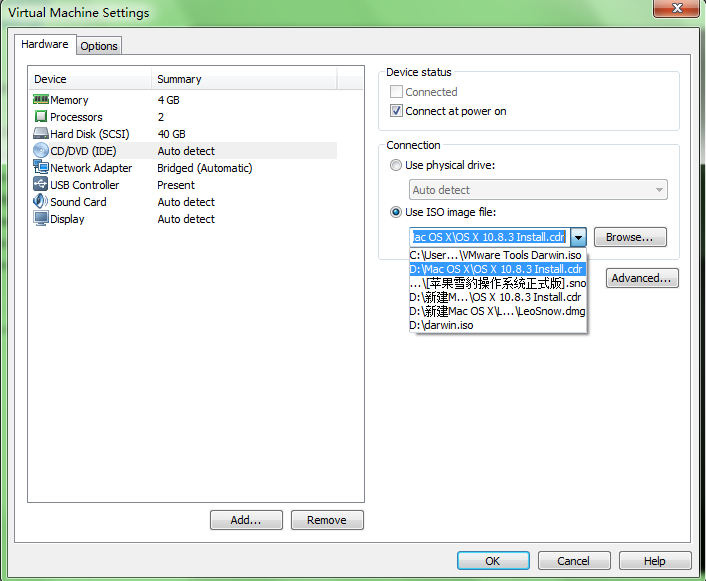

设置完以后，启动虚拟机，进入安装界面。

选择安装语言。

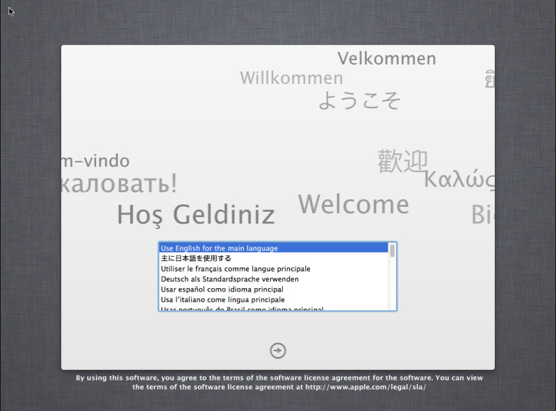

需要磁盘工具。

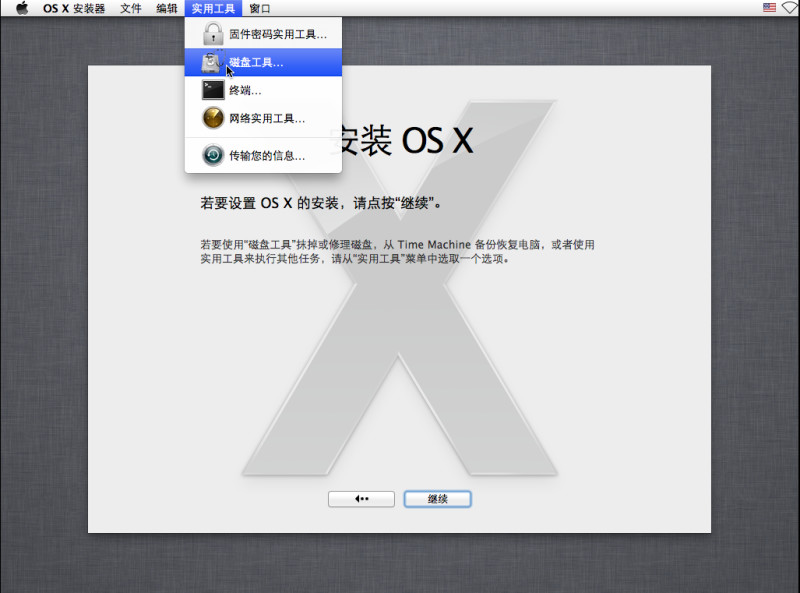

将分配好的磁盘抹掉，格式为“Mac OS 扩展（日志式）”，类似于Windows下的格式化。

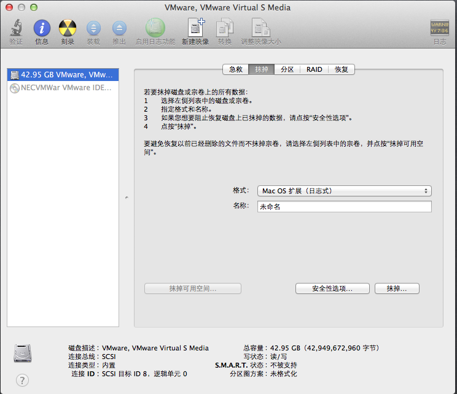

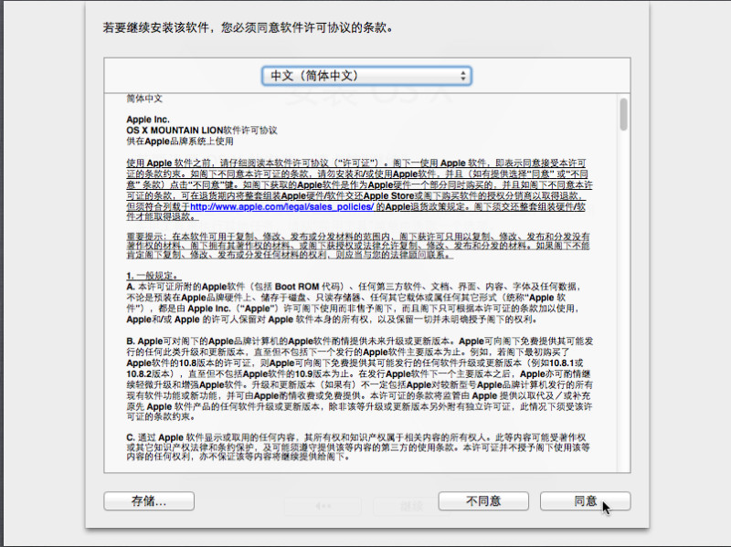

此处因为我的磁盘里已经安装好操作系统，便没有抹掉，若抹掉以后，就会在此处看到磁盘，选择安装即可。

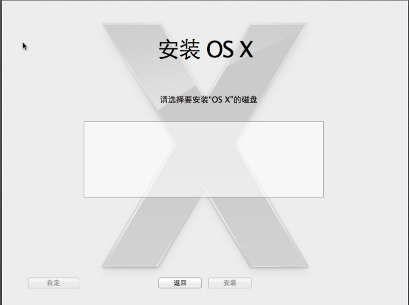

此后便是等待安装完成。

重启后进入苹果操作系统。

## 安装后话

### 网络配置

进入虚拟网络设置

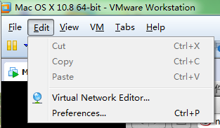

添加网络VMnet0，并选择桥接到本地以太网网卡。

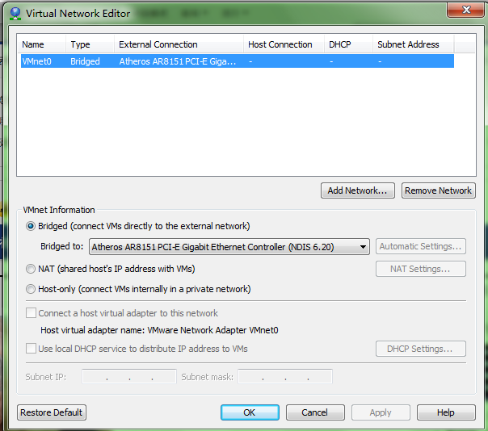

点击“系统偏好设置”，选择网络，可以进入“高级”中设置ip和dns。

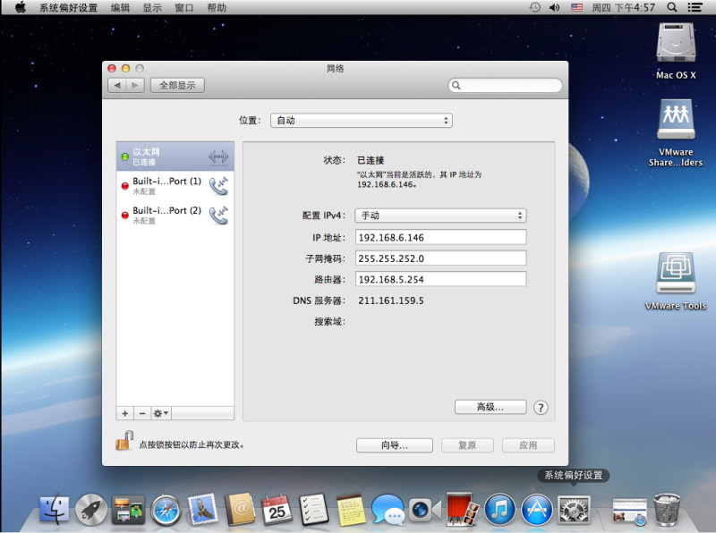

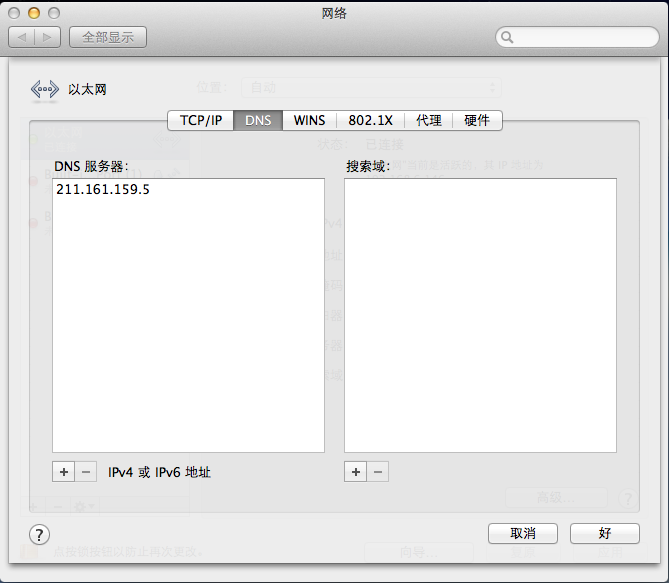

设置完成。

### VMware Tools

右键右下角的光盘图标，选择设置。

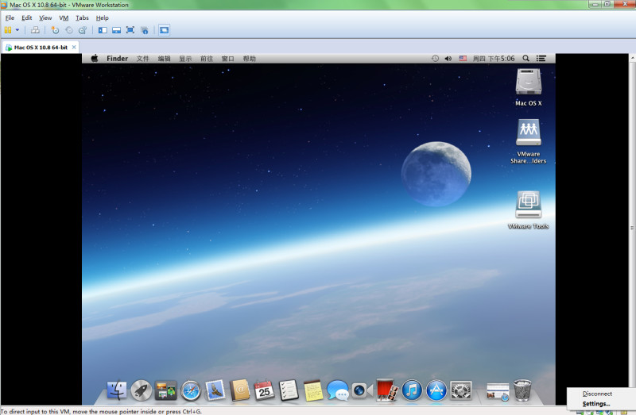

文件选择VMware Tools的镜像文件。

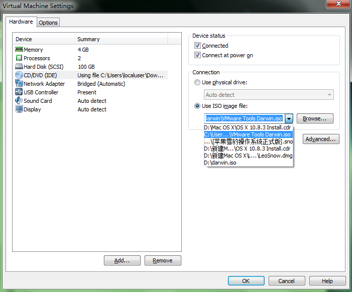

加载后，在桌面上双击安装。

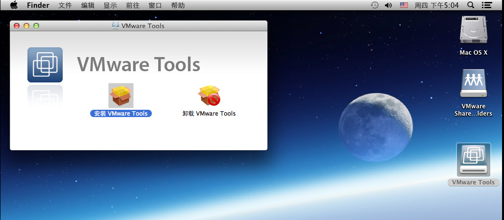

### 与宿主机共享文件夹

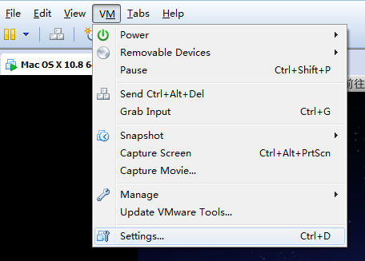

在“选项”中选择“Shared Folders”，设置为“Always enabled”。并“Add”一个新文件夹路径，最后确定。

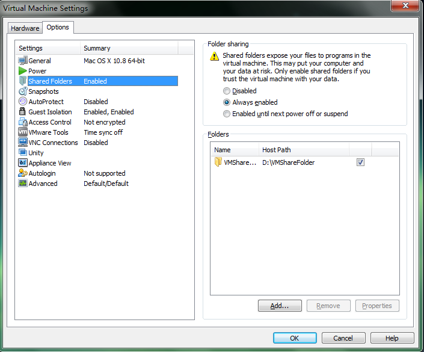

前往Windows的对应路径，可以找到共享文件夹。此内的文件都实现宿主机和虚拟机共享。

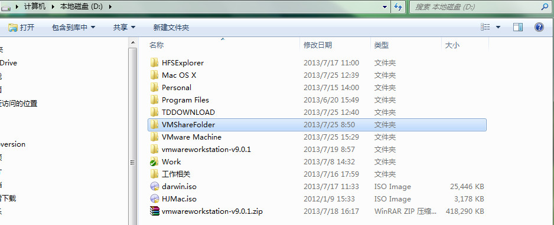

到此，用虚拟机安装的过程总结就结束了。