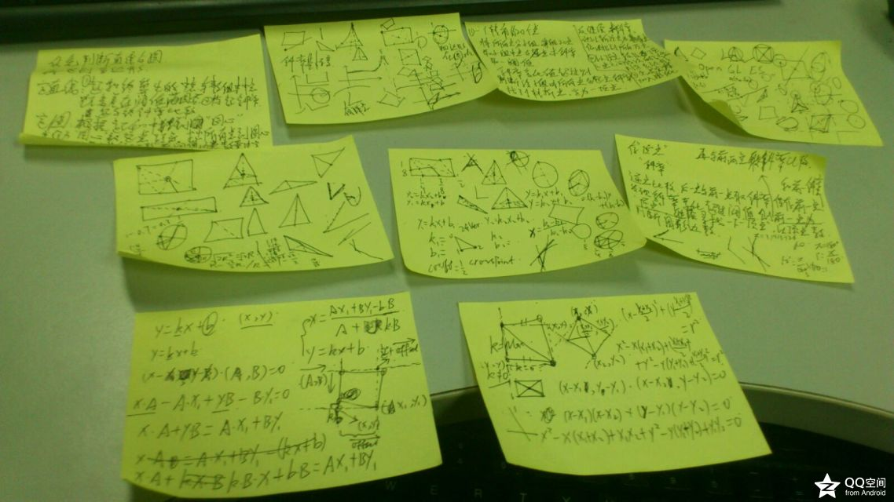

# 智能笔算法总结

### 2013-12-11 15:53

经过琢磨和研究，终于在昨天搞定了这个问题。



看着上图，回想自己渴求帮助的心情，想必有的朋友还是需要这样的算法的，再者在此也做一个总结，所以记录一下，互相学习指正。

## 需求说明 

首先描述下这个功能的需求：在平板上，用手指自由地一笔画出一个图形，然后智能识别用户所画图形的类型，比如直线、圆、三角形或者矩形，并自动变换为最接近的几何图形。

从上面的描述来看，就是自动识别图形的算法。并且已经获得了所勾勒自由图形的点轨迹。在此需要说明一下，我做的项目中，已经有获取点的方法，但并不是将所有像素点记录，而是一系列的轨迹离散点。

所以，开始下面的算法前提就是，已经有一个记录轨迹的点数组了。

我不想写成学术报告一样，先罗列一堆概念什么的，所以就直接按照算法的步骤了，涉及到概念再描述一下。

总体步骤：

1. 求顶点
2. 判断直线
3. 判断圆
4. 判断矩形
5. 判断其他多边形
6. 未知自由图形

整体很直观吧，那开始逐步介绍。

## 求顶点

还记得向量么，还记得怎么求两向量的夹角么，还记得正弦余弦么。好吧，不记得的少年，需要温故一下了。

顶点即是图形中的“转折点”，是两条边的交点，所以存在一定夹角，那么就可以用这两条边的方向向量求出夹角theta的值。方向向量可以根据一条直线上的两点求得，夹角theta根据公式可以得到。

### 伪代码

```
点数组为points;

用于存储顶点的可变数组 vertexes;

前两个点数组 aheadTwoPoints;

aheadTwoPoints[0] = points[0];

aheadTwoPoints[1] = points[1];

上一个参考向量 aheadDirectionVector =

Point2d(aheadTwoPoints[1].x – aheadTwoPoints[0].x , aheadTwoPoints[1].y – aheadTwoPoints[0].y);

 

For(int i=2; i<points.Length; i++){

当前向量 currentDirectionVector = Point(points[i].x – aheadTwoPoints[1].x, points[i].y -  aheadTwoPoints[1].y);

临时向量 tempDirectionVector = currentDirectionVector;

                  

Double cosTheta = (currentDirectionVector.x * aheadDirectionVector.x  +  currentDirectionVector.y * aheadDirectionVector.y) / (sqrt(pow(currentDirectionVector.x, 2) + pow(currentDirectionVector.y , 2)) * sqrt(pow(aheadDirectionVector.x , 2) + pow(aheadDirectionVector.y , 2)));

 

if(fabs(cosTheta) <= 阀值1){

         将aheadTwoPoints[1]加入vertexes;

}else{

         根据points[i]和aheadTwoPoints[0]得到cosTheta2;

         If(fabs(cosTheta2 <= 阀值2)){

         将aheadTwoPoints[1]加入vertexes;

}

}

 

aheadTwoPoints[0] = aheadTwoPoints[1];

aheadTwoPoints[1] = points[i];

aheadDirectionVector = tempDirectionVector;

}
``` 

说明：阀值1和阀值2有待进一步探究，目前我采用的阀值1为cos(M_PI / 3)，阀值2为cos(M_PI / 6).

## 判断直线

当vertexes.Length为0的时候，初步判断为直线或者圆。

### 伪代码

```
If(points[0].distanceTo(points[length - 1]) > points[0].distanceTo(points[length / 2 - 1])){

         中点midPoint = Poin(t(points[0].x + points[length - 1].x) / 2 , (points[0].y + points[length - 1].y) / 2);

         If(midpoint.distanceTo(points[length / 2 - 1]) < 阀值3){

　　　　　　　 实例化一条直线 newLine;

         　　newLine.StartPoint = points[0];

         　　newLine.EndPoint = points[length - 1];

        　　 画出直线;

　　　　　}else{

             实例化一条曲线 newSpline;

             newSpline的数据点为points;

             画出曲线;

         }

}
```

## 判断圆

当二中直线判断条件不满足时，初步判断为圆。

接下来主要根据圆心特点来判断。

### 伪代码

```
先根据points取到1/4、1/2、3/4这三个点，再加上起点，相对的两点求中点，然后近似得到圆心点 centerPoint;

If(points[0].distanceTo(centerPoint) < points[0].distanceTo(points[length - 1])){

         判断为曲线，并画出曲线;

         break;

}

初始化圆 circle;

circle.center = centerPoint;

circle.radius = points[0].distanceTo(centerPoint);

```
 
说明：这里只描述了主要的思想，更多细节就根据具体情况而定了。还有一点，在初始化圆之前，还可以再加一个判断：

先求得points[0]和points[length/4 - 1]的直线为y1，points[length/8 - 1]和圆心的直线为y2，得到y1和y2的交点P，然后求得P和圆心的距离dis1、points[length/8 - 1]和圆心的距离dis2,判断dis1和dis2的大小关系。

在圆里面，dis1/dis2 = 1 – sqrt(2) / 2。

所以如果points[length/8 - 1]和points[length*3/8 - 1]同时满足，那判断就更准了。但是，由于上述代码中基本确定为圆了，所以为了提高容错，我就没有再加说明中的判断了。感兴趣的朋友可以一试。

## 判断矩形

当vertexes.Length为3的时候，直接判断为矩形。

最大的问题就是，重新计算矩形的四个顶点位置。

1. 我采用以起点和vertexes[1]为参照点、以过起点和vertexes[0]的直线为参照直线。
2. 从vertexes[1]向参照直线做垂直直线，求得交点为新的vertexes[0]
3. 然后求出vertexes[0]到vertexes[1]的向量vector
4. 根据points[0]加上向量vector，得到新的vertexes[2]。

### 伪代码

```
实例化一个多段线 polyline;

polyline.setPointAt(0, points[0]);

For(int i=0; i<vertexes.length ; i++){

         polyline.setPointAt(i + 1, vertexes[i]);

}

polyline.setPointAt(vertexes.length + 1, points[0]);
```

说明：当然，在开始重新计算四个顶点位置前，还可以加一个判断，对角线的距离差值是否在一定阀值范围内，或许更好一点。

但是，我非常希望画出矩形，所以就强制实现四个顶点的图形为矩形了。

这里的算法，还有值得推敲的。

## 判断其他多边形

多边行就太轻松了。。。。

只要排除上述几个前提条件，就可以判断图形为（vertexes.length + 1）边行。

然后画出多段线就可以了。

## 未知自由图形

这个。。。。毕竟我的算法有限，还是有很多情况不能识别，主要难点在顶点的识别。所以不满足判断条件的图形就只能将其“原封不动”地画出来了。

## 心得

一开始觉得无从下手，发了一些帖子，但是都没有得到回答，心里比较烦。但是当自己全心投入，去研究去思考以后，还是会有回报，会有意外的收获。

这让我联想起一路学习编程的情况。起初对编程很恐惧，觉得密密麻麻的代码，看得心烦，但是当静下心来去读代码，去思考代码中的逻辑时，就会不断发现惊喜，赞叹牛人的思维逻辑，赞叹各种算法，赞叹各种设计模式，赞叹强大的API。就是这样的一种心情，引领着我这个菜鸟一步一步走进编程的世界，也开始了自己的成长之路。

不知不觉，走出学校参加工作已经有五个月了。这段时间，心理变化也是很多很复杂的。过去的不必纠结，大家都知道着眼未来，可我还是很乐意为今天现在的自己赞一个的。自己认可自我的提升和改变，这也是一件意义重大的事呢。

这个算法就描述到这里了，希望能够给需要的朋友一个提示，也希望得到指正和讨论。