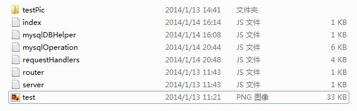

# APNS功能之Node.js和Mysql应用总结

### 2014-01-27 10:15

这篇文档主要是总结Node.js和Mysql的学习心得体会。当然也可以看作是此前所写的消息推送服务的续篇。

简单描述下应用背景，我们的应用需要实现苹果的消息推送服务APNs，之前已经实现了iOS客户端配置和功能代码，也实现了推送通知的本地Provider功能代码，具体参考此前的系列总结。好比一个三角形，A点代表iOS移动设备端，B点代表苹果的消息推送服务器，C点代表应用开发者的本地服务器，现在A和B连接好了，B和C也连接好了，就差A和B建立连接沟通。

这样一来，很明显就是要在本地搭建一个服务器了，可以处理A发送的请求；当然也少不了数据库，用来存储相关数据。

说到这里，不同技术背景的人会有不同的方案，在此我采用了Node.js+Mysql的解决方案。当然其他方案如ASN.NET、JSP、PHP加上SQLServer、Mysql、MongoDB等等就不谈论了。纯粹作为技术学习和新方案的尝试。

## Node.js

作为这篇文档的重点内容，Node.js肯定是要优先总结的。

我这种刚学习Node.js的新手，就不敢把此文当做Node.js的入门资料了，只是简单介绍一下，然后直接根据应用需求实现代码。

Node.js实现了服务端Javascript，通过简单快捷的环境搭建，就可以实现一个运行Javascript的服务器。

### 安装步骤

1. 去官网下载最新的Node.js安装程序。说明一下，我是在Windows32位操作系统上安装，所以下载Windows对应安装程序即可。我的版本为：node-v0.10.24-x86。
2. 安装Node.js。
3. 在开始—>所有程序中，找到Node.js的命令行程序Node.js command prompt并运行

好了，至此，你已经可以开始编程了。就是这么简单快捷。

或许很多人还是很困惑，那在哪里写代码呢，命令行？

在此，我要说一下刚接触时候我的感受：我觉得很郁闷，不知道从何入手。

对于很多新手，大家需要的是把事情说明白一点，而不是玄乎。可以这样理解，Node.js就是一个服务器，用于搭载Javascript、CSS、Html等网页所可以有的一切。但是他本身不集成IDE。再具体点，他的出现，使我们可以不用熟悉的IIS、Apache、Tomcat来部署了，只需要运行Node.js，然后通过一句话“node xxx.js”，加载已经写好的Javascript，就一切OK了。是的，Javascript，那用你熟悉的任何方式和工具去书写吧。Notepad++是我选择的工具。

## 示例

一定还有疑惑，没关系，我们先来看示例。

下面实现一个可以上传图片文件并预览的页面，还有一个向数据库插入一条数据的请求。

先看这个例子NodejsDemo的文件夹结构



### 说明

1. index.js是入口
2. server.js用于启动服务
3. router.js用于路由请求
4. requesHandlers.js用于处理路由后的对应请求
5. mysqlOperation.js用于处理数据库操作
6. mysqlDBHelper.js用于连接数据库并操作

接下就是具体代码部分了，太多语法我无法一下说清楚，在需要的地方，我会稍加说明，想了解更多，建议去官网查看API说明，毕竟是抛砖引玉。

### index.js的代码

```
var server = require("./server");

var router = require("./router");

var requestHandlers = require("./requestHandlers");

 

var handle = {}

handle["/"] = requestHandlers.start;

handle["/start"] = requestHandlers.start;

handle["/upload"] = requestHandlers.upload;

handle["/show"] = requestHandlers.show;

handle["/sendMyInfo"] = requestHandlers.sendMyInfo;

 

server.start(router.route, handle);
```

说明：这是示例的入口，最后一句，调用server中的start方法，并传递两个参数，第一个是router中route函数，第二个是类似字典实例的handle。

### server.js的代码

```
var http = require('http');

var url = require('url');

function start(route, handle){

              function onRequest(req,res){

                       var pathname = url.parse(req.url).pathname;

                       console.log("Request for " + pathname + " received.");

                      

                       route(handle, pathname, res,req);         

              }

              http.createServer(onRequest).listen(1337, 'Your IP');

              console.log('Server running at http://Your IP:1337/');

}

 

exports.start = start;
```

说明：与require(“./server”)调用同级目录js文件不同，require(‘http’)是生成一个http对象实例的方法。url.parse(string).pathname用于获取url字符串中路径名称。Your IP为本机的IP地址。http.createServer(function).listen(端口号，’IP’)用于通过一个方法创建一个服务，并在设置的iP和端口号监听。Exports.start=start为其他js对象调用本方法暴露接口。

### route.js的代码

```
function route(handle, pathname, res, req){

              console.log("About to route a request for " + pathname);

              if(typeof handle[pathname] === 'function'){

                       handle[pathname](res, req);

              }else{

                       console.log("No request handler found for " + pathname);

                       res.writeHead(404, {'Content-Type': 'text/plain'});

                       res.end('404 route not found');

              }

}

 

exports.route = route;
```

说明：路由请求，当请求未定义的路径时，则在response的head里面返回404错误。

### requestHanlders.js的代码

```
var querystring = require ("querystring");

var url = require('url');

var fs = require("fs");

var formidable = require("formidable");

var util = require("util");

var mysqlOperation = require("./mysqlOperation");

var testPicPath = "/testPic/test.png";

function start(res, req){

              console.log("Request handler 'start' was called.");

              var body = '<html>'+

                       '<head>'+

                       '<meta http-equiv="Content-Type" content="text/html; '+

                       'charset=UTF-8" />'+

                       '</head>'+

                       '<body>'+

                       '<form action="/upload" enctype="multipart/form-data" method="post">'+

                       '<input type="file" name="upload">'+

                       '<input type="submit" value="Upload file" />'+

                       '</form>'+

                       '</body>'+

                       '</html>';

              res.writeHead(200, {'Content-Type': 'text/html'});

              res.end(body);

}

 

function upload(res, req){

              console.log("Request handler 'upload' was called.");

 

              var form = new formidable.IncomingForm();

 

              console.log("about to parse");

 

              form.parse (req, function(error, fields, files) {

                       console.log("parsing done");

/*                  res.writeHead(200,{"Content-type":"text/plain"});

                       res.write("received upload:\n\n");

                       res.write(util.inspect({fields:fields,files:files})); */

 

                       fs.rename(files.upload.path, '/testPic/' + files.upload.name, function(err){

                                 if(err) throw err;

                                 console.log("renamed complete");

                                 testPicPath =  "/testPic/" + files.upload.name;

                                

                                 res.writeHead (200, {"Content-Type": "text/html"});

 

                                 res.write ("received image:<br/>");

 

                                 res.write ("");

 

                                 res.end();

                       }); 

              });

}

 

function show(res, req) {

              console.log("Request handler 'show' was called.");

              fs.readFile (testPicPath, "binary", function(error, file) {

                       if(error) {

                                 res.writeHead (500, {"Content-Type": "text/plain"});

                                 res.write ("Image error: " + error + "\n");

                                 res.end();

                       } else {

                                 res.writeHead (200, {"Content-Type": "image/png"});

                                 res.write (file, "binary");

                                 res.end();

                       }

              });

}

 

function sendMyInfo(res,req){

              console.log("Request handler 'sendMyInfo' was called.");

              var urlstring = url.parse(req.url).query;

              var user = {

                       name : querystring.parse(urlstring).name,

                       country : querystring.parse(urlstring).country,

                       city : querystring.parse(urlstring).city,

                       street : querystring.parse(urlstring).street

              };

             

              if(use.name == undefined || user.country == undefined

|| user.city == undefined || user.street == undefined){

                       res.writeHead (500, {"Content-Type": "text/plain"});

                       res.write ("error: paras undefined.");

                       res.end();

                       console.log("error: paras undefined.");

                       return;

              }

             

              console.log(user);

              mysqlOperation.storeUserInfo(user,res);

}

 

exports.start = start;

exports.upload = upload;

exports.show = show;

exports.sendMyInfo = sendMyInfo;
```

说明：这个js文件是处理请求的主要地方，当路由路径后，会找到相应方法。

这里需要重点说一下start方法。在返回response内容时候，直接采用字符串方式表达body，当然这是不好的习惯，那么在疑惑页面的朋友就可以在这里找到答案了。Node.js有负责加载页面的API，还有类似于模板页的结构，以前熟悉的方式依然可以使用。至于其他方法，相信你会看明白的。还有，为什么错误返回码总是500呢，因为是我随意设置的。。。

至此，一个简单的Node.js的demo就完成了，噢，忘了方法sendMyInfo，那是等下继续要说的。马上运行Node.js的命令行程序，然后在“路径>”后面输入“node index.js路径”，回车就可以看到Server running的输出提示了。在浏览器里面访问“Your IP：Your port/”。

多说一句，index.js的全路径是绝对无误的，当index.js处于用户根目录时，可以直接输入“node index.js”；当index.js处于node.js的安装磁盘根目录时候，可以直接输入“node /index.js”。

在方法sendMyInfo中，我试图向数据库中插入一条记录。那就接着进入node.js的数据库连接和操作吧。

## Node.js的数据库操作之创建数据库

我们可以先在Mysql数据库里面创建好一个新的database和一个用户表users。也可以通过Node.js来创建，代码如下

```
var mysql = require('mysql');

var db_options = {

    host: "localhost",

    port: 3306,

    user: "root",

    password: "Your password"

};

var client = new mysql.createConnection(db_options);

 

//要创建的数据库名 

var TEST_DATABASE = 'NodeJsTest', 

    //要创建的表名 

    TEST_TABLE = Users;

 

client.query('show databases', function(err, rows, fields){

         if(err){

                   console.log(err);

         }else{

                   console.log(rows);

         }

});

 

client.query('CREATE DATABASE '+TEST_DATABASE, function(err) { 

  if (err && err.number != client.ERROR_DB_CREATE_EXISTS) { 

    throw err; 

  } 

}); 

 

// If no callback is provided, any errors will be emitted as `'error'` 

// events by the client 

client.query('USE '+TEST_DATABASE); 

client.query( 

  'CREATE TABLE '+TEST_TABLE+

  ‘name VARCHAR(255), '+ 

  ' country VARCHAR(255),'+ 

  ' city VARCHAR(255), '+ 

  ' street VARCHAR(255),' 

); 

 

client.query( 

  'INSERT INTO '+TEST_TABLE+' '+ 

  'SET name = ?, country = ?, city = ?, street = ?', 

  ['Li Lei', 'China', 'Bei jing', ‘ ’] 

); 

 

client.query('USE '+TEST_DATABASE);

client.query( 

  'SELECT * FROM '+TEST_TABLE, 

  function selectCb(err, results, fields) { 

    if (err) { 

      throw err; 

    } 

 

    console.log(results);

         console.log(results[0].name);

         console.log(results.length);   

    console.log(fields);  

  } 

); 

 

client.end();
```

说明：Your password为你的Mysql数据库密码。好了，可以将代码所在的js文件直接加载到命令行中，方法还是“node xxxx.js”。如果你之前已经在运行index.js了，那么按下crtrl+C停下之前的服务。我想运行结果会成功的，除非node.js的API又升级了，这个时候就去查官网API吧。

##  Node.js的数据库操作之插入数据

```
var mysql = require('mysql');

var db_options = {

    host: "localhost",

    port: 3306,

    user: "root",

    password: "Your password"

};

 

//database name 

var DATABASE = ‘NodeJsTest’, 

//table name 

TABLE = 'Users';

function storeUserInfo(user, res){

         if(user.name == " "){

                   res.writeHead (600, {"Content-Type": "text/plain"});

                   res.write ("error: name can not be empty.\n");

                   res.end();

                   return;

         }

         var client = new mysql.createConnection(db_options);

         client.query('USE '+DATABASE);

        

         client.query( 

                   "SELECT * FROM "+ TABLE + " WHERE name = ?",

                   [user.name],

                   function(err, results, fields) { 

                            if (err) {

                                     client.end();

                                     res.writeHead (700, {"Content-Type": "text/plain"});

                                     res.write ("error: " + err);

                                     res.end();

                                     return; 

                            } 

                           

                            console.log(results.length);

                            if(results.length < 1){

                                     //Added new record

                                     client.query( 

"INSERT INTO "+ TABLE + " SET name = ?, country = ?, city = ?, street = ? ", [user.name, user.country, user.city, user.street],

                                               function(err, results, fields) { 

                                                        if (err) { 

                                                                 client.end();

                                                                 res.writeHead (700, {"Content-Type": "text/plain"});

                                                                 res.write ("error: " + err);

                                                                 res.end();

                                                                 return; 

                                                        }                          

                                                       

                                                        client.end();

                                                        res.writeHead (200, {"Content-Type": "text/plain"});

                                                        res.write ("added new user");

                                                        res.end();

                                                        console.log(results); 

                                                        console.log(fields);  

                                               } 

                                     ); 

                            }else if(results.length == 1){

                                     //Update record

                                     client.query(

"UPDATE " + TABLE + " SET name = ?, country = ?, city = ?, street = ? WHERE name = ?", [user.name],

                                               function(err, results, fields) { 

                                                        if (err) {

                                                                 client.end();

                                                                 res.writeHead (700, {"Content-Type": "text/plain"});

                                                                 res.write ("error: " + err);

                                                                 res.end();                                                                 

                                                                 return; 

                                                        }                          

                                                       

                                                        client.end();

                                                        res.writeHead (200, {"Content-Type": "text/plain"});

                                                        res.write ("updated");

                                                        res.end();

                                                        console.log(results); 

                                                        console.log(fields);  

                                               }

                                     )

                            }else{

                                     client.end();

                                     res.writeHead (700, {"Content-Type": "text/plain"});

                                     res.write ("error: Repeat records exist!");

                                     res.end();

                                     console.log("Repeat records exist!");

                                     //handle

                            }  

                   } 

         ); 

}

 

exports.storeUserInfo = storeUserInfo;
```

说明：这个js实现向数据库里面插入一条记录，如果已存在该用户，则更新用户信息。就是这样的熟悉味道。

忘了一点，我没有封装这个demo的数据库连接，因为当操作多了以后，还是封装一个负责数据库连接操作的DBHelper比较好。

到此，Node.js的总结就结束了，别忘了重新node index.js后，在浏览器里面访问“Your IP : Your port/sendMyInfo?name=xxx&country=xxx&city=xxx&street=xxx”。