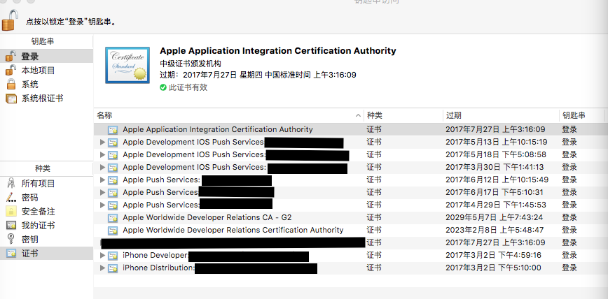
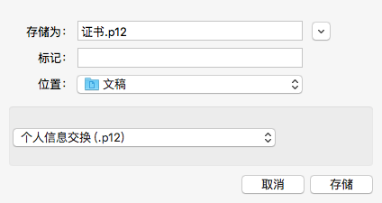

# iOS证书深究

### 2014-04-28 17:56

iOS的系列证书很令人头痛，但是也提供了完整的保护。

在开发过程中，遇到的基本的证书有Xcode真机调试或者打包用证书，也有消息推送证书等；每种证书分为开发版（development）和发布版（distribute）。除了证书，还有概要配置文件。众多的分类和配置，很容易混淆，接下来详细描述一番，并解释我的理解。

## 苹果开发者中心的证书

### 主要分类：Certificate、AppID、Device、Provisioning Profile

AppID是一切的开始，就如一个身份证，和每个人是唯一对应的；根据identifier生成不同类型的证书，都在Certificate列表里，证书之间都是平等关系，例如消息推送证书不是根据打包证书生成的，而同样是根据identifier产生的；Device列表管理测试用设备；Provisioning Profile是概要配置文件，是联系identifier、设备、证书的一个纽带，一般先选择AppID，然后指定证书和测试设备，进而产生作为纽带的配置文件。

除了上述对象，在产生部分文件过程中，还有一个证书签名请求文件（CSR），这是标识Mac OS系统的，上述文件要用在哪台Mac机上，就用该机钥匙串生成的CSR文件。

不然，会出现如下错误：将非本Mac机CSR文件支持产生的证书导入钥匙串，是找不到私钥的，这样就无法在Xcode中使用。

各种证书的生成方法和过程，想必不会太纠结，按照提示就可以了，关键在于使用过程中的关系。

### 推送证书

推送证书是根据AppID产生的，然后下载下来，格式为.cer，也可以先双击加入钥匙串，然后在钥匙串中导出p12格式的文件，也可以生产.pem格式，供不同推送程序直接加载使用。而推送证书跟应用的唯一关联关系，就存储于概要配置文件中，所以应该先生产推送证书，后生成概要配置文件。否则就会引发推送无效的问题。

### Ad Hoc证书

这种证书跟发布版（distribute）类似，也就是说可以Archive成ipa安装包。但是不能上传到AppStore中。主要用于给远方合作的测试人员使用。这样既解决了远距离安装测试的问题，也避免了ipa包被他人传到AppStore中。

### 开发版和发布版证书

开发版和发布版证书会产生不同的deviceToken，但是只有前者才能在Xcode中log输出看到，因为后者只能Archive打包成ipa包，所以为了测试，可以show一个UIAlertView出来。

这就引申出消息推送的一个问题。在测试开发版和发布版app时候，同一台设备，会产生两个deviceToken，切记不要搞错了推送目标！

## 下载和加载证书

证书生成好以后，下载下来，双击，就会自动加载到钥匙串的“登陆”项中，有私钥就说明添加成功了。概要配置文件也是双击，会自动加载到Xcode中。然后去Xcode的Target编译设置中，找到Code Signing项，对应debug、release、distribute三种模式，先选择相应的配置文件，然后在证书配置项里就可以看到跟配置文件关联的证书选项。

将苹果开发者中心生成好的真机调试和发布用的证书、推送用的证书加入钥匙串后（指由当前Mac设备在开发者中心创建的证书），可以看到如下列表（因有多个应用，所以请忽略推送证书的个数）：

## 导出p12证书

选中iPhone Developer：xxxx 这个开发调试证书，保证“专用密钥”未展开，右键选择“导出xxxxxx”，出现如下界面：

可以更改名称和存储位置，点击“存储”，会出现要求输入密码的界面，也可以不输入密码（即后续使用不需要密码），直接确定。

导出的p12证书可以传给其他同事，双击添加到钥匙串，便于对同一个开发者账号下的项目进行真机调试。

对于发布证书可以有同样的操作。

### p12证书的主要用途

你可能涉及到的p12证书的主要用途：

1. 用于多个开发者和多台设备配合开发调试
2. 通过第三方平台推送消息，例如友盟推送
3. 生成pem证书，用于推送消息

## 推送用的pem证书生成流程

对推送证书进行上述p12证书生成操作，例如得到一个apns-dev-cert.p12

然后展开“专用密钥”，右键密钥，导出得到apns-dev-key.p12

然后打开终端程序，依次输入下列指令：

openssl pkcs12 -clcerts -nokeys -out apns-dev-cert.pem -in apns-dev-cert.p12

openssl pkcs12 -nocerts -out apns-dev-key.pem -in apns-dev-key.p12

按要求输入密码，然后再输入如下指令：

cat apns-dev-cert.pem apns-dev-key.pem > apns-dev.pem

最后得到的apns-dev.pem文件，即可用于部分推送消息的平台

对于发布证书可以有同样的操作。

## 遇到的证书错误

1. 如果提示钥匙串里的iPhone Developer：xxxx或者Distribution：xxxx过期，则需要在开发者中心重新编辑或生成证书，加入钥匙串，生成p12证书给同事
2. 如果提示“苹果的安全证书过期”，需要前往下载新的安全证书，不过下次过期还有很多年。下载地址：[AppleWWDRCA.cer](https://developer.apple.com/certificationauthority/AppleWWDRCA.cer) 
3. 如果Xcode编译提示provisioning profile错误，则是配置概要文件错误，需要配置当前应用Debug或者Release模式对应证书下的provisioning profile
4. Archive打包导出ipa时候，提示“证书已经存在，但本地未安装”，多半指ad hoc证书未正确配置。
5. 谨慎点击“revoke”按钮，此操作会导致开发和发布证书重置

简单来说，只要p12证书正确导入，多数问题由provisioning profile引起。