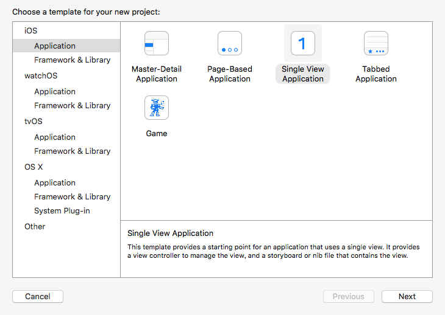
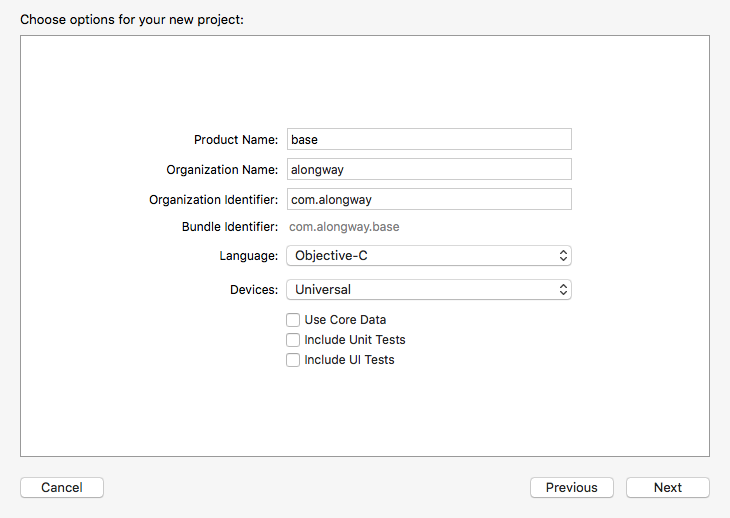
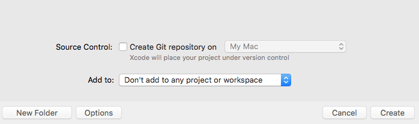
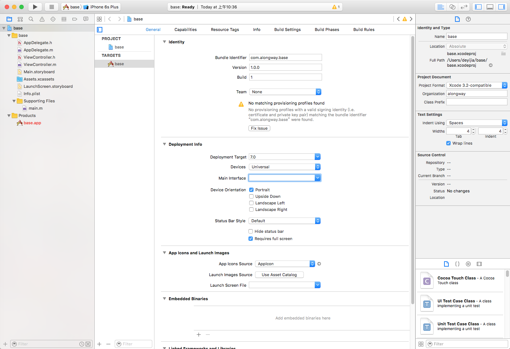
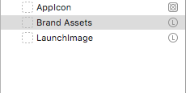
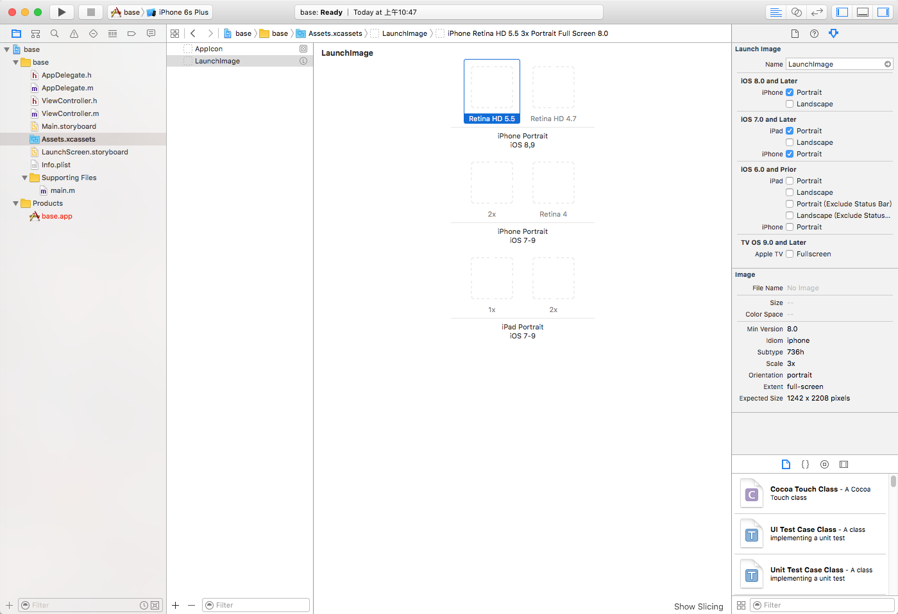
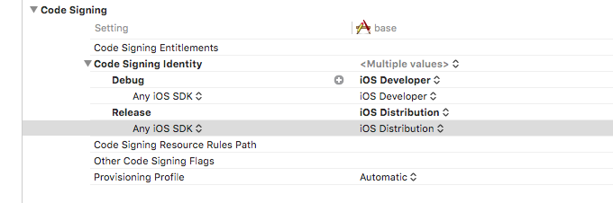
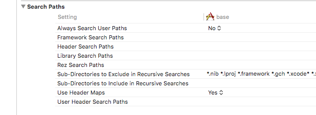
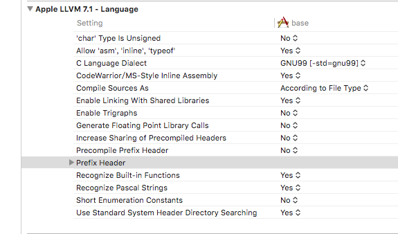

# App开发流程之创建项目和工程基本配置

### 2016-08-31 13:30

我的开发环境为：Mac OS X EI Capitan（10.11.6），Xcode 7.3.1

首先说明一下这个项目的初衷，我并非要创建一个完整的上架应用，旨在创建一个可运行的，通用配置、架构，提供通用组件和辅助工具的基础项目。以达到，克隆或者下载就可以快速装配新项目，聚焦于实际的应用逻辑开发。所以，我命名这个项目为“base”，而且项目会在github上同步，可以配合博客和git提交日志查看。

## 创建项目

我以Single View Application为例，创建项目。我习惯于纯代码编程，该模板初始结构适当，后续忽略的文件较少。

上述选项界面，提示几点：

1. 设备选择通用类型，我希望可以适配全设备
2. 如果数据储存有FMDB或者LevelDB之类的方案，可以不用Core Data
3. 不需要添加单元测试和UI测试，何必保留多余的内容

 

上述选择项目存放路径界面，重要的是代码版本管理选项，默认勾选了Xcode的git方式管理，如果想采用sourcetree之类软件来管理代码版本，不建议勾选。因为在项目根目录下生成的.git隐藏文件会导致sourcetree管理失效，解决办法是后续删除.git文件。

## 工程General配置

上述为创建成功的界面，不过对general配置稍作改动：

1. version，建议采用1.0.0格式；build号在每次提交到iTunes connect前才必须修改
2. team，可以忽略，或者添加开发者账号
3. deployment target按需选择，建议将PROJECT下的base的发布版本保持一致
4. main interface不打算采用main.storyboard，清空
5. 这个base项目只想采用竖屏
6. 如果未支持设备全方向，就必须勾选requires full screen，否则会编译错误
7. 启动时候不采用LaunchScreen.storyboard，清空

如果启动时候采用各设备单张启动图，清空Launch Screen File栏，然后点击Use Asset Catalog，直接确定，没有必要在左侧文件列表中增加新的xcassets文件。

生成新的Brand Assets暂时不是需要的。

1. 在上述截图的空白位置右键，选择AppIcons & LaunchImages -> New iOS Launch Images，生成新的LaunchImage文件如上图
2. 右键Brand Assets，remove selected items
3. 回到general配置界面，Launch Images Source选择LaunchImages
4. 点击AppIcons或者LaunchImages右边箭头，或者选中左侧列表的Assets.xcassets文件，进入详细配置界面

上图右侧选中箭头图标，则是配置具体在不同版本上的icon或者启动图，image栏则显示了相关需求信息。直接将其他地方的png图片拖放到对应网格中即可，拖放后，可右键网格中图片在Finder中查看具体存放位置。只需注意一点，icon和启动图必须为png格式的图片。

## Build Settings配置

基础配置已经完成，只需要注意以下配置：

1.Bitcode默认为YES，提交到iTunes connect后，苹果会拆分包资源，为不同设备生成较小体积的ipa文件；如果项目中有不支持bitcode的代码，编译会报错，需要手动设置为NO

2.Code Signing配置真机调试和发布用的证书，如果已经添加了相关证书和配置概要文件，按如下配置Xcode可自动识别

3.Other Linker Flags一般不需要设置，在添加某些第三方库以后，需要设置

4.Info.plist File该文件记录了应用的重要配置，默认配置了路径；可以修路径，指向自定义plist文件的位置

5.Search Paths需要特别注意Framework、Header、Library三项的Search Paths，添加第三方库以后会自动加入，也可手动管理。注意两点：一是删除第三方库后，如果提示找不到该库，需要手动来此删除路径；二是，编辑路径，建议使用项目相对位置``“$(PROJECT_DIR)”``

6.Prefix Header如果添加了预编译头文件，此处管理预编译头文件的路径，建议用相对位置“$(SRCROOT)”

以上，对创建项目和工程基本配置进行了记录。