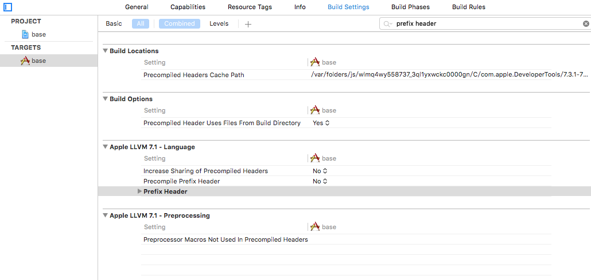

# App开发流程之增加预编译头文件

### 2016-08-31 17:04

在继续增加预编译头文件前，先稍等。

Xcode为我们创建了一个模板项目，很棒！但有一点不太令人满意，问题就在下图中：


这是一个新项目的初始文件目录，几乎所有文件都在同一级目录下，随着项目文件数量急速增加，这将是一场噩梦。所以，我们需要整理一下文件结构，这也算是初步的项目构架了。

还要注意一点，Xcode的base目录下，应该是有一个“Supporting Files”文件夹的，main.m文件在其中，而两个storyboard文件是在base目录下的。可是物理目录下，并非如此。因为Xcode的文件目录存在一种逻辑目录结构，实际上所有文件都可以在同一级目录下。

实际项目管理中，建议尽量避免这样的情况，让文件的物理目录和逻辑目录保持一致，便于右键在Finder中查看。

很简单，我们只需要先在物理目录下创建一个新文件夹“Supporting Files”，将Info.plist和main.m文件拖入其中：


回到Xcode，出现如下情况：


直接将Info.plist文件、Supporting Files文件夹、main.m文件右键Delete。

右键base文件夹，“Add Files to base”，添加Supporting Files文件夹，还可以拖动Supporting Files文件夹到合适的索引位置：


至此，对支持文件的目录整理就完成了。

注意：

1. 由于移动了plist文件，所以工程general配置界面，Identity栏无法解析，只需要重新选定plist文件即可
2. 需要在build settings界面重新配置plist文件的路径，如果Xcode没有自动重新配置的话

## 添加预编译头文件

预编译头文件，一般用于引用第三方框架和库头文件，还可以引用存储全局宏定义头文件，便于全局使用。

右键上图的“Supporting Files” -> New File，选择pch文件，如下图：


确认前，勾选Target：base

切换到Build Settings界面，在搜索栏搜索：prefix header，在目标栏双击输入：

```$(SRCROOT)/base/Supporting Files/PrefixHeader.pch```

如下图：



至此，预编译头文件添加完成，具体使用后续再记录。