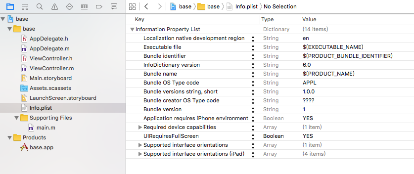
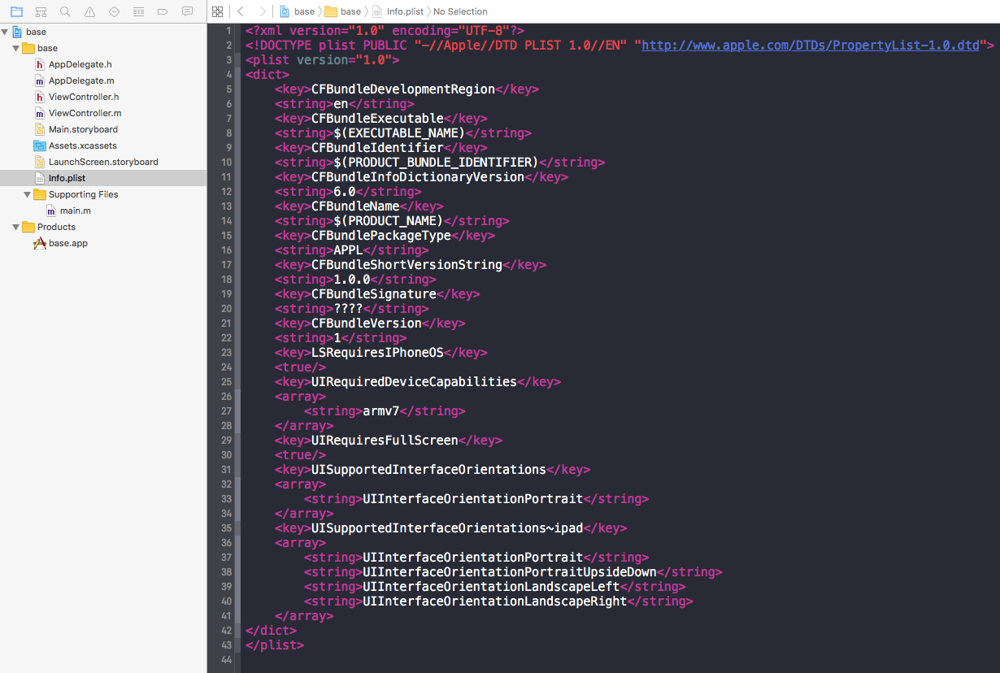
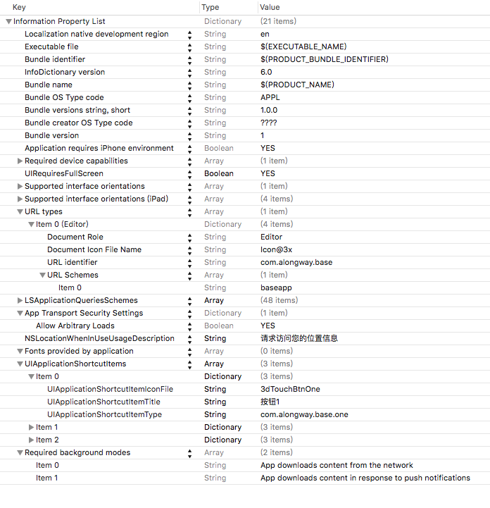

# App开发流程之配置Info.plist文件

### 2016-08-31 15:57

Info.plist文件控制应用的全局配置，例如bundle name，display name。

先来看一下默认创建的Info.plist文件



右键左侧的Info.plist文件，可以open as “property list”或者“source code”来查看。例如下图：



接下来，我将以code方式查看，并添加下列常用配置：

```
<key>CFBundleURLTypes</key>
<array>
    <dict>
        <key>CFBundleTypeRole</key>
        <string>Editor</string>
        <key>CFBundleURLIconFile</key>
        <string>Icon@3x</string>
        <key>CFBundleURLName</key>
        <string>com.alongway.base</string>
        <key>CFBundleURLSchemes</key>
        <array>
            <string>baseapp</string>
        </array>
    </dict>
</array>
    
<key>LSApplicationQueriesSchemes</key>
<array>
    <string>wechat</string>
    <string>weixin</string>
    <string>sinaweibohd</string>
    <string>sinaweibo</string>
    <string>sinaweibosso</string>
    <string>weibosdk</string>
    <string>weibosdk2.5</string>
    <string>mqqapi</string>
    <string>mqq</string>
    <string>mqqOpensdkSSoLogin</string>
    <string>mqqconnect</string>
    <string>mqqopensdkdataline</string>
    <string>mqqopensdkgrouptribeshare</string>
    <string>mqqopensdkfriend</string>
    <string>mqqopensdkapi</string>
    <string>mqqopensdkapiV2</string>
    <string>mqqopensdkapiV3</string>
    <string>mqzoneopensdk</string>
    <string>wtloginmqq</string>
    <string>wtloginmqq2</string>
    <string>mqqwpa</string>
    <string>mqzone</string>
    <string>mqzonev2</string>
    <string>mqzoneshare</string>
    <string>wtloginqzone</string>
    <string>mqzonewx</string>
    <string>mqzoneopensdkapiV2</string>
    <string>mqzoneopensdkapi19</string>
    <string>mqzoneopensdkapi</string>
    <string>mqqbrowser</string>
    <string>mttbrowser</string>
    <string>renrenios</string>
    <string>renrenapi</string>
    <string>renren</string>
    <string>renreniphone</string>
    <string>laiwangsso</string>
    <string>yixin</string>
    <string>yixinopenapi</string>
    <string>instagram</string>
    <string>whatsapp</string>
    <string>line</string>
    <string>fbapi</string>
    <string>fb-messenger-api</string>
    <string>fbauth2</string>
    <string>fbshareextension</string>
    <string>baidumap</string>
    <string>iosamap</string>
    <string>comgooglemaps</string>
</array>
    
<key>NSAppTransportSecurity</key>
<dict>
    <key>NSAllowsArbitraryLoads</key>
    <true/>
</dict>
    
<key>NSLocationWhenInUseUsageDescription</key>
<string>请求访问您的位置信息</string>
    
<key>UIAppFonts</key>
<array/>
    
<key>UIApplicationShortcutItems</key>
<array>
    <dict>
        <key>UIApplicationShortcutItemIconFile</key>
        <string>3dTouchBtnOne</string>
        <key>UIApplicationShortcutItemTitle</key>
        <string>按钮1</string>
        <key>UIApplicationShortcutItemType</key>
        <string>com.alongway.base.one</string>
    </dict>
    <dict>
        <key>UIApplicationShortcutItemIconFile</key>
        <string>3dTouchBtnTwo</string>
        <key>UIApplicationShortcutItemTitle</key>
        <string>按钮2</string>
        <key>UIApplicationShortcutItemType</key>
        <string>com.alongway.base.two</string>
    </dict>
    <dict>
        <key>UIApplicationShortcutItemIconFile</key>
        <string>3dTouchBtnThree</string>
        <key>UIApplicationShortcutItemTitle</key>
        <string>按钮3</string>
        <key>UIApplicationShortcutItemType</key>
        <string>com.alongway.base.three</string>
    </dict>
</array>
    
<key>UIBackgroundModes</key>
<array>
    <string>fetch</string>
    <string>remote-notification</string>
</array>
```

然后已列表方式查看结果，如下图：



说明：

1. URL types选项，描述应用被其他应用调起的配置，url schemes数组目前只有一个item，表示只有baseapp://协议可以调起该应用，如果后续有添加分享SDK，会增加更多的item，例如sina.xxxx、QQxxx
2. LSApplicationQueriesSchemes选项，则决定了本应用可调起的其他应用，例如想调起微信，则需要添加item：wechat，目前添加了48个应用url scheme
3. App Transport Security Settings选项，决定了应用可以访问哪些安全的HTTPS协议域名，上述设置表示可以访问http和https的所有域名，否则就需要添加“Exception Domains”选项，自己罗列安全的域名
4. NSLocationWhenInUseUsageDescription选项，用于iOS8以后用户使用定位服务时候的提示内容。NSLocationUsageDescription用于iOS6-8之间的版本。类似的选项还有相机、通讯录、蓝牙等的提示
5. Fonts provided by application选项，添加自定义字体文件名称，一般为ttf文件，后续再说明代码中如何使用自定义字体
6. UIApplicationShortcutItems选项，适用于iPhone6s之后的设备，提供本应用icon的3d Touch菜单，后续再说明代码中如何使用
7. Required background modes选项，设置应用在后台可进行短时间内的下载活动

Info.plist文件是很重要的应用配置文件，更多选项，可以在Xcode -> Help -> Documentation中查看。