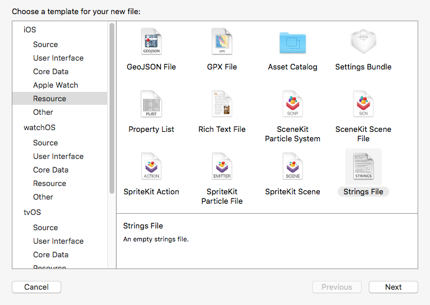
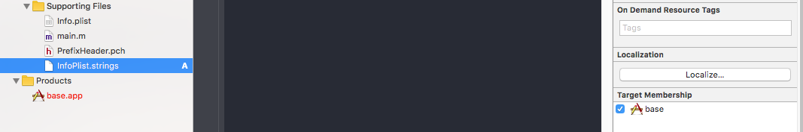
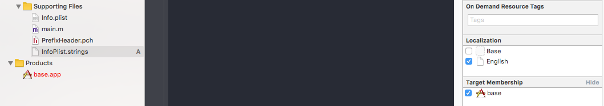
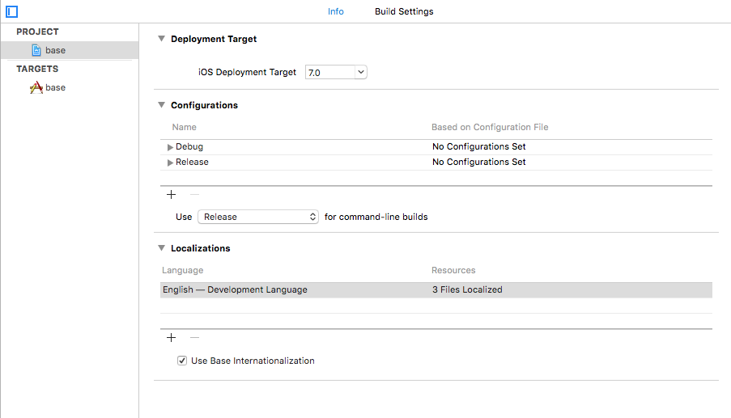
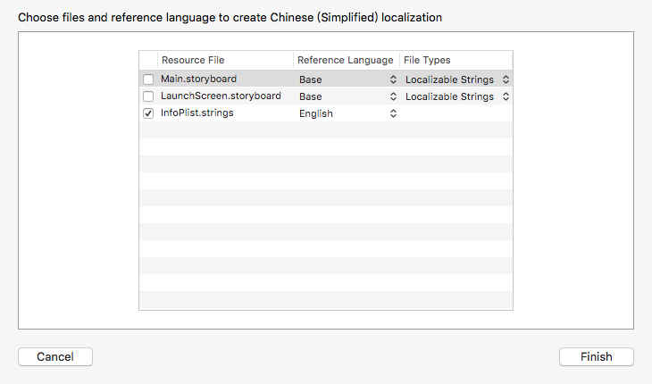
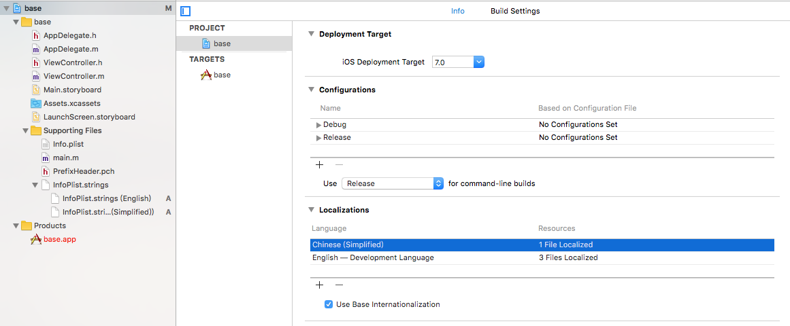

# App开发流程之本地化

### 2016-09-01 18:02

主要涉及Info.plist文件和字符串文件的本地化。

## 本地化Info.plist文件

1.在Xcode文件目录中，右键Supporting Files文件夹 -> New File -> Resource -> Strings File

 

命名必须为“InfoPlist”



2.点击右侧“Localize...”按钮，在弹出框中，先选择语言“English”，确定，即生成英语对应的本地化文件。

可在Finder中看到en.lproj文件夹目录下存在InfoPlist.strings文件。



3.选中工程文件的Project栏的base -> Info



点击Localizations栏的“+”按钮，选中简体中文（hans）



忽略两个storyboard文件，只勾选InfoPlist.strings，点击Finish完成Info.plist文件本地化配置工作。



4.点击InfoPlist.strings(English)，添加代码：CFBundleDisplayName = "Base";

点击InfoPlist.strings(Simplified)，添加代码：CFBundleDisplayName = "基础";

以上代码就完成了对应用显示名称的本地化操作。

如果之前在模拟器上运行过本项目（可以先注释代码运行一次），应用名应该一直为小写的“base”，重新运行项目，即可在模拟器上看到不同系统语言对应的不同应用名称。

## 字符串的本地化

1. 如上述第一步一样，在Supporting Files目录下创建Strings File文件，不过这次命名必须为“Localizable”，其他操作步骤一样，只不过这次生成英语本地化文件后，就可以看到有简体中文本地化文件待选。

2. 配置完成后，在Localizable.strings(English)文件中添加类似的代码：```"hello world" = "hello world!"```;Localizable.strings(Simplified)中添加类似代码：```"hello world" = "你好，世界!"```;

3. 在AppDelegate.m文件的didFinishLaunchingWithOptions方法中添加如下代码：```NSLog(@"%@", NSLocalizedString(@"hello world", @"hello world"));```

4. 在模拟器上运行，切换系统语言，可以看到Xcode控制台的输出的不同内容

### 说明：

1. NSLocalizedString宏定义可以自动识别名为Localizable的Strings File文件，所以使用该宏定义，必须注意命名

2. 使用非Localizable名称的Strings File文件，读取时候，需要用NSLocalizedStringFromTable(key, tbl, comment)宏定义，可以指定自定义名称的Strings File文件（tbl参数）。使用此方法，可以通过代码控制显示特定语言的本地化内容，而不受当前系统语言的限制

3. comment参数无实际作用，只用于描述

以上，就是本地化操作的记录。