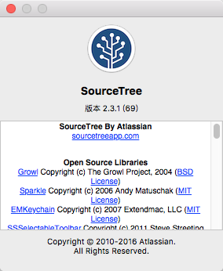
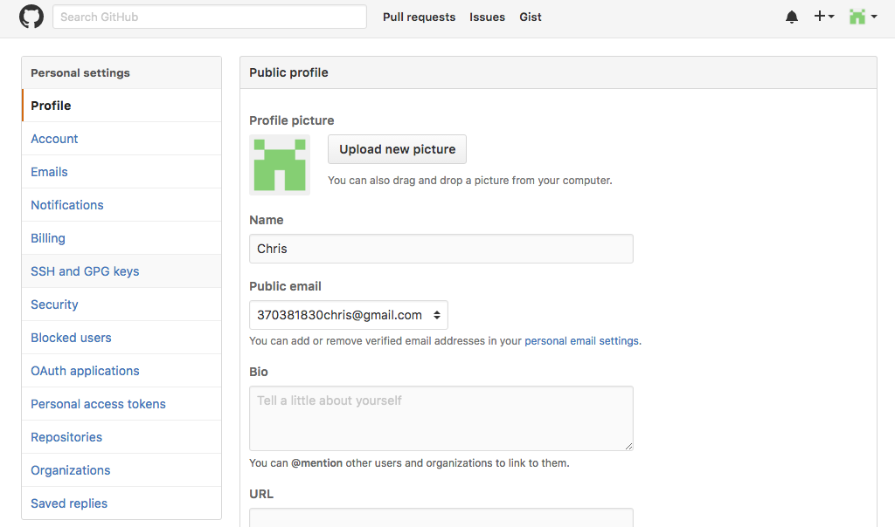
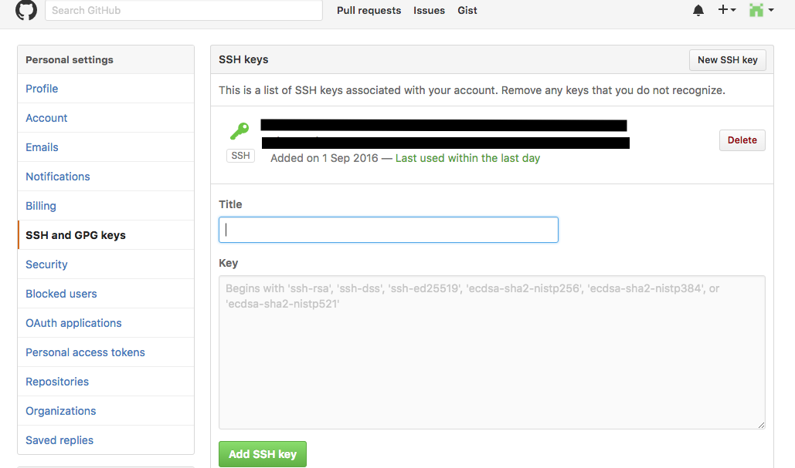
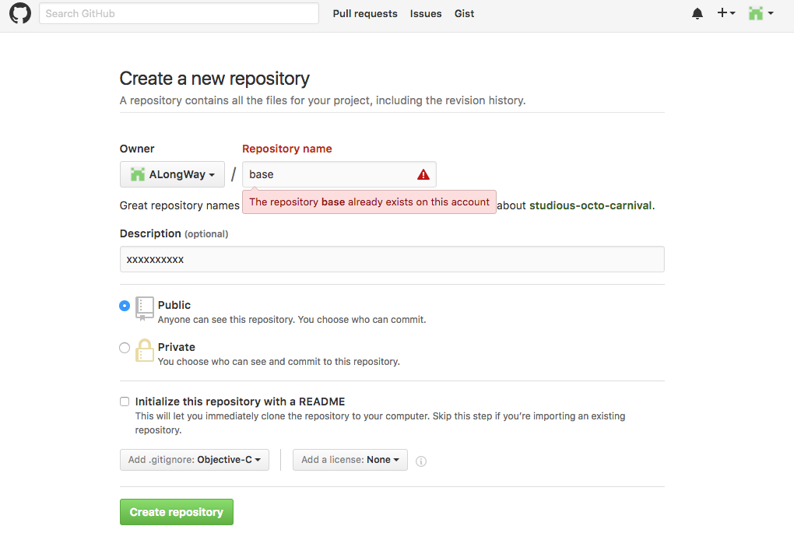
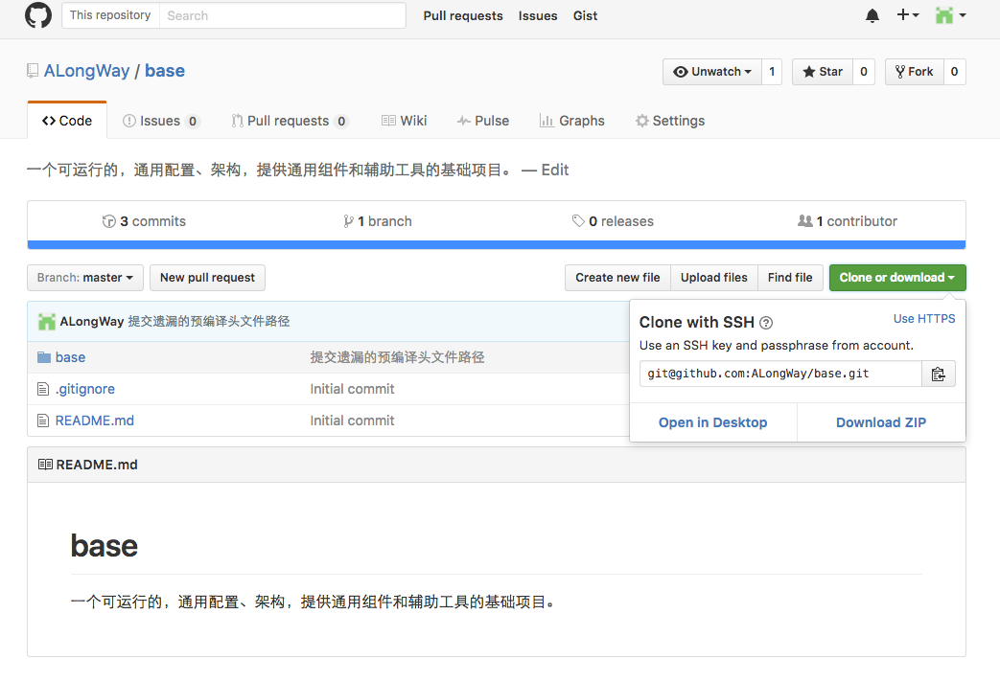
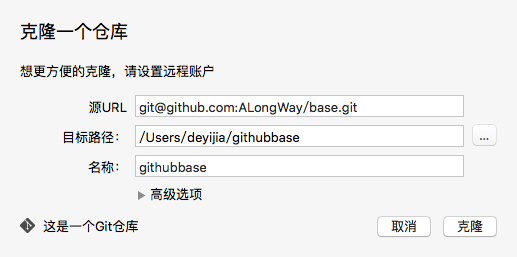
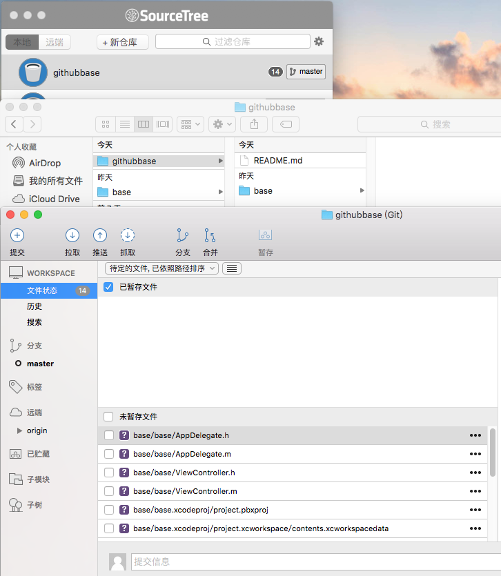
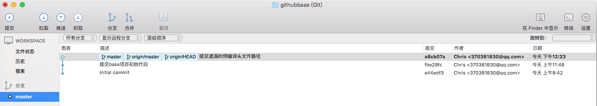

# App开发流程之源代码Git管理

### 2016-09-01 11:49

base项目已经可以编译运行了，只不过没有实际功能而已。继续完善base项目前，我们需要考虑一下代码管理的事情了。

不管是一个人开发还是一个团队开发，对源代码进行版本管理是必须的，任何人对代码的的任何操作都可以被管理，理由还不够充分么。

以前使用过SVN，不过体验最好的，还是Git方式。

1. 本地仓库简单易用，可以完全脱离远程仓库来使用
2. 所有主干和分支都统一管理，切换自如
3. 合并代码轻松愉快

Xcode自带代码Git管理，创建项目时候就提到过，当时有建议不采用，因为准备使用其他的管理工具。

如果创建项目时候，使用了Xcode的git管理，可以通过下面两种方式修改：

### 方式一：

1. 打开终端，输入指令：defaults write com.apple.finder AppleShowAllFiles -bool true（false 表示不显示隐藏类型的文件）
2. 删除项目根目录下的隐藏文件.git
3. 使用新的管理软件进行git管理

### 方式二：
直接将根目录下可见的文件及文件夹拷贝到新的根文件夹里，即可对该根文件夹进行版本管理。

## 源代码Git管理配置

管理方案：Github + SourceTree

1. 前往https://github.com，注册一个账号

2. 下载git客户端。Github也提供了一个客户端，直接使用账号密码登录来管理项目，下载地址：[https://desktop.github.com/](https://desktop.github.com/)。也有用命令行来控制的朋友，我就不讨论了。我由于还在使用SourceTree管理其他项目，所以这里就继续采用SourceTree了。



使用git方式，多半都会涉及SSH key，简单记录一下生成过程。

说明一下：

github客户端采用账号密码就可以验证使用者的身份，进而对自己的项目进行管理。SSH key简化了输入账号密码的流程，将SSH key加入github账号后，github授权生成该SSH key的设备可以使用git管理工具管理github上的项目。

## SSH key生成及设置过程

1.在Finder的当前用户根目录下，前往（shift+command+G）文件夹“~/.ssh”
　如果存在xxxx.pub文件，则是目标文件，用文本编辑器打开，将全部内容拷贝

根据如下示图，找到github添加SSH key的位置：



如上图点击登录后页面的最右边的icon -> settings 进入设置页面



如上图选中SSH and GPG keys栏，点击“New SSH key”按钮，title用来描述用，key栏copy上拷贝的SSH key内容，最后点击“Add SSH key”即可。

 

2.如果上述文件不存在。打开终端，输入：

```ssh-keygen -t rsa -C "xxxx@xxxx.com"```

然后回车，根据提示完成操作即可。“xxxx@xxxx.com”建议为github的账号邮箱
   生成以后，按照步骤1即可。

完成上述操作以后，就可以使用SourceTree了。

到这里，我们可以选择在SourceTree中设置远程账户，先根据base项目生成本地仓库，然后根据本地仓库创建远程仓库。也可以不设置账户，先在Github上创建一个仓库名为“base”，然后使用ssh克隆到本地，再将项目文件移入其中。我使用了后者。

## 创建仓库

### 点击下图所示右上角加号按钮 -> new repository 出现如下页面



说明：输入仓库名和可选描述，类型默认公开，如果想设置为私密类型，需要付费。

在此，提供另一个git仓库平台[Gitlab](https://about.gitlab.com/)，可以免费创建私密仓库，使用方式和Github类似。

还可以勾选添加一个README文件和.gitignore文件，前者可以使得立即克隆该仓库到本地，忽略文件默认不显示，记录git仓库不管理的文件或者类型。license暂时忽略。

### 创建成功以后的页面如下图：



建议使用SSH验证方式克隆，点击clone or download按钮，复制字符串：xxxxxxx/base.git

### 打开本地已安装好的Sourcetree，点击“+新仓库” -> 从url克隆，出现如下界面



将copy的字符串作为源URL，目标路径和名称会自动填写。

我将Xcode创建的项目和SourceTree克隆下来的项目放到了同一个文件夹下，为了区别，将克隆下来的根目录重命名为“githubbase”。

完成克隆以后，将base项目复制到githubbase目录下即可。

### 打开这个本地仓库以后，就可以看到未暂存文件了。



## 关于SourceTree的使用，记录如下几点

1. 勾选未暂存文件，可以加入已暂未文件列表，即成为待提交文件
2. 左上角“提交”按钮，只是将修改提交到本地仓库
3. “推送”按钮即是提交到远程仓库
4. “拉取”按钮即是同步远程仓库最新代码
5. 可以右键暂存文件，“忽略”此文件或者此类型，例如.xcworkspacedata
6. “分支”按钮可以创建新的分支，具体到分支或者主干版本，右键可以checkout切换当前编辑分支
7. 右键到非编辑分支，可以合并入当前分支
8. 右键到某个文件，可以查看修改日志
9. 解决冲突可以使用外联工具
10. 菜单栏SourceTree -> 偏好设置 ->通用，可以设置提交代码时候的全名和电子邮件地址作为身份标识
11. 就算设置了通用身份标识，也可以为每个仓库分别设置。



右上角的设置 ->高级，可以设置当前仓库的用户信息

更多详细功能和操作就不一一记录了。

至此，源代码已经被管理起来。

源代码：[https://github.com/ALongWay/base](https://github.com/ALongWay/base )