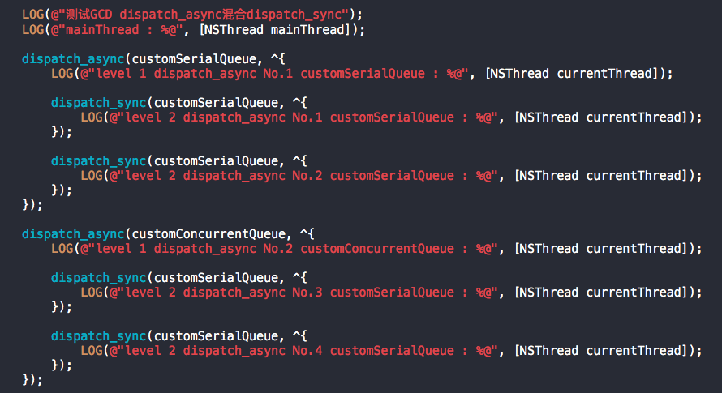

# App开发流程之使用GCD

### 2016-09-30 17:25

GCD即为Grand Central Dispatch的缩写，是一种主要用于异步处理任务的安全的高性能解决方案。

在此不对比其他异步处理技术，只记录GCD的使用及说明。

## 必要的概念

先记录一些必要的概念：线程，同步，异步，并行队列，串行队列

1. 线程：程序中任务执行流的最小单元。一个应用程序，一般存在一个进程（拥有独立内存空间），而每个进程可以有多个线程，即多个任务执行流，类似于工厂车间的流水线。每个应用程序至少存在一个线程，即为主线程，作为唯一可以控制UI的线程。

2. 同步：主要指多个任务在同一个线程上依次执行。

3. 异步：主要指多个任务在不同线程上同时执行。

4. 队列：C语言中的队列指先进先出（FIFO）的数据结构，与栈的先进后出（FILO）相反。在GCD中分```DISPATCH_QUEUE_SERIAL```（串行队列）和```DISPATCH_QUEUE_CONCURRENT```（并行队列）。

5. 并行队列：主要指队列中多个任务可以同时执行。

6. 串行队列：主要指队列中多个任务只能依次执行。

## 常见的重要系列方法1

逐个记录重要的方法：

### ```dispatch_queue_t dispatch_get_main_queue(void)```

获取主线程关联的队列。主队列是串行队列，该队列中任务都将由主线程执行，UI相关的操作必须加入此队列。

 
### ```dispatch_queue_t dispatch_get_global_queue(long identifier, unsigned long flags)```

获取全局通用的并行队列。第一个参数一般指定优先级，有如下选项：

```
DISPATCH_QUEUE_PRIORITY_HIGH        

DISPATCH_QUEUE_PRIORITY_DEFAULT    

DISPATCH_QUEUE_PRIORITY_LOW         

DISPATCH_QUEUE_PRIORITY_BACKGROUND
```

第二个参数，用于标记，一般传入0即可。

 
### ```dispatch_queue_t dispatch_queue_create(const char *label, dispatch_queue_attr_t attr)```

自定义创建一个派发队列。第一个参数作为描述，例如"newcustomqueue"；第二个参数一般指定队列内任务是串行```DISPATCH_QUEUE_SERIAL```还是并行```DISPATCH_QUEUE_CONCURRENT```类型。

### ```void dispatch_async(dispatch_queue_t queue, dispatch_block_t block)```

将一个block加入队列，异步执行。

### ```void dispatch_sync(dispatch_queue_t queue, dispatch_block_t block);```

将一个block加入队列，同步执行。

## 使用和测试以上方法 

定义了几个队列：

```
dispatch_queue_t mainQueue = dispatch_get_main_queue();

dispatch_queue_t globalQueue = dispatch_get_global_queue(DISPATCH_QUEUE_PRIORITY_DEFAULT, 0);

dispatch_queue_t customSerialQueue = dispatch_queue_create("customserialqueue", DISPATCH_QUEUE_SERIAL);

dispatch_queue_t customConcurrentQueue  = dispatch_queue_create("customconcurrentqueue", DISPATCH_QUEUE_CONCURRENT);
```

### 使用示例一：


总结：

上述代码，在同一次运行中，执行了多次，其中两次截图如上。

1. 主队列必定在主线程中执行

2. 在主线程中，使用dispatch_async异步执行非主队列中任务，将产生新的子线程

### 使用示例二：


总结：

主线程卡死。该方法在block执行完之前不会return，而block也是在当前线程执行，所以互相等待，造成死锁。

在主线程中使用同步执行主队列任务，将死锁。


### 使用示例三：




总结：

子线程卡死，UI依然可以操作。

综合示例二和三，得出：在执行（同步或者异步）串行队列的线程中再使用dispatch_sync同步执行当前串行队列，将造成线程死锁。

 
### 使用示例四：


总结：

调用dispatch_sync将在当前线程上依次执行添加的任务，不管是否在同一队列中，也不管队列类型。


### 使用示例五：

```
LOG(@"测试GCD dispatch_async混合dispatch_sync");
LOG(@"mainThread : %@", [NSThread mainThread]);

dispatch_async(customSerialQueue, ^{
    LOG(@"level 1 dispatch_async No.1 customSerialQueue : %@", [NSThread currentThread]);
    
    dispatch_async(customSerialQueue, ^{
        LOG(@"level 2 dispatch_async No.1 customSerialQueue : %@", [NSThread currentThread]);
    });
    
    dispatch_async(customSerialQueue, ^{
        LOG(@"level 2 dispatch_async No.2 customSerialQueue : %@", [NSThread currentThread]);
    });
    
    dispatch_async(customSerialQueue, ^{
        LOG(@"level 2 dispatch_async No.3 customSerialQueue : %@", [NSThread currentThread]);
    });
    
    //==============================
    dispatch_async(customConcurrentQueue, ^{
        LOG(@"level 2 dispatch_async No.4 customConcurrentQueue : %@", [NSThread currentThread]);
    });
    
    dispatch_async(customConcurrentQueue, ^{
        LOG(@"level 2 dispatch_async No.5 customConcurrentQueue : %@", [NSThread currentThread]);
    });
    
    dispatch_async(customConcurrentQueue, ^{
        LOG(@"level 2 dispatch_async No.6 customConcurrentQueue : %@", [NSThread currentThread]);
    });
    
    //==============================
    dispatch_sync(customConcurrentQueue, ^{
        LOG(@"level 2 dispatch_sync No.7 customConcurrentQueue : %@", [NSThread currentThread]);
    });
    
    dispatch_sync(customConcurrentQueue, ^{
        LOG(@"level 2 dispatch_sync No.8 customConcurrentQueue : %@", [NSThread currentThread]);
    });
    
    dispatch_sync(customConcurrentQueue, ^{
        LOG(@"level 2 dispatch_sync No.9 customConcurrentQueue : %@", [NSThread currentThread]);
    });
});

dispatch_async(customConcurrentQueue, ^{
    LOG(@"level 1 dispatch_async No.2 customConcurrentQueue : %@", [NSThread currentThread]);
    
    dispatch_sync(customSerialQueue, ^{
        LOG(@"level 2 dispatch_sync No.10 customSerialQueue : %@", [NSThread currentThread]);
    });
    
    dispatch_sync(customSerialQueue, ^{
        LOG(@"level 2 dispatch_sync No.11 customSerialQueue : %@", [NSThread currentThread]);
    });
    
    dispatch_sync(customSerialQueue, ^{
        LOG(@"level 2 dispatch_sync No.12 customSerialQueue : %@", [NSThread currentThread]);
    });
    
    //==============================
    dispatch_async(customConcurrentQueue, ^{
        LOG(@"level 2 dispatch_async No.13 customConcurrentQueue : %@", [NSThread currentThread]);
    });
    
    dispatch_async(customConcurrentQueue, ^{
        LOG(@"level 2 dispatch_async No.14 customConcurrentQueue : %@", [NSThread currentThread]);
    });
    
    dispatch_async(customConcurrentQueue, ^{
        LOG(@"level 2 dispatch_async No.15 customConcurrentQueue : %@", [NSThread currentThread]);
    });
    
    //==============================
    dispatch_async(customSerialQueue, ^{
        LOG(@"level 2 dispatch_async No.16 customSerialQueue : %@", [NSThread currentThread]);
    });
    
    dispatch_async(customSerialQueue, ^{
        LOG(@"level 2 dispatch_async No.17 customSerialQueue : %@", [NSThread currentThread]);
    });
    
    dispatch_async(customSerialQueue, ^{
        LOG(@"level 2 dispatch_async No.18 customSerialQueue : %@", [NSThread currentThread]);
    });
});
```


总结：

1. 串行队列customSerialQueue，只关注任务加入的先后顺序，不管是同步还是异步执行，总体顺序不变

2. 多个同步执行的同一串行队列，如果加入了另一个执行队列，他们的执行线程相同

3. 多个异步执行的同一串行队列，如果加入了另一个执行队列，他们的执行线程相同

4. 综合上述，使用dispatch_sync，一定是在当前线程执行；使用dispatch_async，不一定产生新的子线程，如果在同一级下，执行串行队列，将使用已存在的同一线程。

5. 多个嵌套的异步执行并行队列，可能使用已存在的闲置线程

## 常见的重要系列方法2

### ```void dispatch_barrier_async(dispatch_queue_t queue, dispatch_block_t block);```

该方法与dispatch_async类似，将block加入队列异步执行。注意当先加入队列的任务都执行完后，才轮到该block执行，唯一异步执行，执行完毕后才会执行其他任务。所以只有加入并行队列，该方法才有意义。特别适用于加锁操作。

### ```void dispatch_barrier_sync(dispatch_queue_t queue, DISPATCH_NOESCAPE dispatch_block_t block);```

该方法与dispatch_sync类似，将block加入队列同步执行。注意当先加入队列的任务都执行完后，才轮到该block执行，唯一同步执行，执行完毕后才会执行其他任务。所以只有加入并行队列，该方法才有意义。特别适用于加锁操作。

### 上述两者不同的地方

```dispatch_barrier_async```函数会先将后续代码中的任务加入队列，只是控制任务的执行顺序；```dispatch_barrier_sync```函数要求指定的任务执行完毕后，才将后续代码中的任务加入队列并执行。

 
### ```void dispatch_after(dispatch_time_t when, dispatch_queue_t queue, dispatch_block_t block);```

将block加入队列，延迟一定时间后异步执行。

#### 使用示例：

```
dispatch_after(dispatch_time(DISPATCH_TIME_NOW, (int64_t)(5.0 * NSEC_PER_SEC)), dispatch_get_main_queue(), ^{

        //code to be executed after a specified delay

});
```

表示在5秒以后，将block加入主队列异步执行。

### ```void dispatch_apply(size_t iterations, dispatch_queue_t queue, void (^block)(size_t));```

将block加入队列指定次数。队列可以是并行的，所以block执行可以为并行。iterations表示循环总次数。

#### 测试代码：

```
dispatch_apply(10, globalQueue, ^(size_t index) {

    LOG(@"dispatch_apply : %zu", index);

});
```

```
2016-09-30 16:57:33.023 base[33146:8699303] dispatch_apply : 0
2016-09-30 16:57:33.023 base[33146:8699545] dispatch_apply : 1
2016-09-30 16:57:33.023 base[33146:8699530] dispatch_apply : 2
2016-09-30 16:57:33.024 base[33146:8699631] dispatch_apply : 3
2016-09-30 16:57:33.024 base[33146:8699303] dispatch_apply : 4
2016-09-30 16:57:33.024 base[33146:8699303] dispatch_apply : 8
2016-09-30 16:57:33.024 base[33146:8699303] dispatch_apply : 9
2016-09-30 16:57:33.024 base[33146:8699545] dispatch_apply : 5
2016-09-30 16:57:33.024 base[33146:8699530] dispatch_apply : 6
2016-09-30 16:57:33.024 base[33146:8699631] dispatch_apply : 7
``` 

### ```void dispatch_once(dispatch_once_t *predicate, dispatch_block_t block);```

只执行block中代码一次。特别适用于单例模式。

#### 使用示例：

```
static dispatch_once_t onceToken;

dispatch_once(&onceToken, ^{

});
```

## 常见的重要系列方法3

### ```void dispatch_group_async(dispatch_group_t group, dispatch_queue_t queue, dispatch_block_t block);```

该方法将加入队列的block分组管理，特别适用于多方法并行，最后整合全部结果。第一个参数由如下方法得到：

```dispatch_group_t dispatch_group_create(void);```

 
### ```void dispatch_group_notify(dispatch_group_t group, dispatch_queue_t queue, dispatch_block_t block);```

该方法用于group中所有任务都完成后，回调block内容。

#### 示例代码：

```
dispatch_group_t group = dispatch_group_create();
    
dispatch_group_async(group, globalQueue, ^{
    LOG(@"dispatch_group_async : 1");
});
    
dispatch_group_async(group, globalQueue, ^{
    LOG(@"dispatch_group_async : 2");
});
    
dispatch_group_async(group, globalQueue, ^{
    LOG(@"dispatch_group_async : 3");
});
    
dispatch_group_async(group, globalQueue, ^{
    LOG(@"dispatch_group_async : 4");
});
    
dispatch_group_notify(group, globalQueue, ^{
    LOG(@"dispatch_group_async : completion");
});
```

```
2016-09-30 17:19:15.490 base[33322:8718096] dispatch_group_async : 1
2016-09-30 17:19:15.490 base[33322:8718097] dispatch_group_async : 3
2016-09-30 17:19:15.490 base[33322:8718042] dispatch_group_async : 2
2016-09-30 17:19:15.490 base[33322:8718098] dispatch_group_async : 4
2016-09-30 17:19:15.491 base[33322:8718098] dispatch_group_async : completion
```

### ```void dispatch_group_enter(dispatch_group_t group);```
### ```void dispatch_group_leave(dispatch_group_t group);```

虽然上面的例子，没有使用enter和leave函数，也实现了group的效果，但是继续看下面的例子：

```
dispatch_group_t group = dispatch_group_create();
    
dispatch_group_async(group, globalQueue, ^{
    LOG(@"dispatch_group_async : 1");
    dispatch_async(globalQueue, ^{
        LOG(@"dispatch_group_async : 5");
    });
    
    dispatch_after(dispatch_time(DISPATCH_TIME_NOW, (int64_t)(2 * NSEC_PER_SEC)), dispatch_get_main_queue(), ^{
        LOG(@"dispatch_group_async : 6");
    });
});
    
dispatch_group_async(group, globalQueue, ^{
    LOG(@"dispatch_group_async : 2");
});
    
dispatch_group_async(group, globalQueue, ^{
    LOG(@"dispatch_group_async : 3");
});
    
dispatch_group_async(group, globalQueue, ^{
    LOG(@"dispatch_group_async : 4");
});
    
dispatch_group_notify(group, globalQueue, ^{
    LOG(@"dispatch_group_async : completion");
});
```

```
2018-07-27 14:11:00.706103+0800 base[96150:18276013] dispatch_group_async : 1
2018-07-27 14:11:00.706116+0800 base[96150:18276012] dispatch_group_async : 2
2018-07-27 14:11:00.706131+0800 base[96150:18276011] dispatch_group_async : 3
2018-07-27 14:11:00.706138+0800 base[96150:18276005] dispatch_group_async : 4
2018-07-27 14:11:00.706261+0800 base[96150:18276011] dispatch_group_async : 5
2018-07-27 14:11:00.706337+0800 base[96150:18276005] dispatch_group_async : completion
2018-07-27 14:11:02.899388+0800 base[96150:18275683] dispatch_group_async : 6
```

这个时候就可以看出问题所在了，常见的业务场景是异步发出网络请求，请求完成后，再整合多个网络请求的结果。

我们加上enter和leave函数后的例子如下：

```
dispatch_group_t group = dispatch_group_create();
    
    dispatch_group_enter(group);
    dispatch_group_async(group, globalQueue, ^{
        LOG(@"dispatch_group_async : 1");
        dispatch_async(globalQueue, ^{
            LOG(@"dispatch_group_async : 5");
        });
        
        dispatch_after(dispatch_time(DISPATCH_TIME_NOW, (int64_t)(2 * NSEC_PER_SEC)), dispatch_get_main_queue(), ^{
            LOG(@"dispatch_group_async : 6");
            dispatch_group_leave(group);
        });
    });
    
    dispatch_group_async(group, globalQueue, ^{
        LOG(@"dispatch_group_async : 2");
    });
    
    dispatch_group_async(group, globalQueue, ^{
        LOG(@"dispatch_group_async : 3");
    });
    
    dispatch_group_async(group, globalQueue, ^{
        LOG(@"dispatch_group_async : 4");
    });
    
    dispatch_group_notify(group, globalQueue, ^{
        LOG(@"dispatch_group_async : completion");
    });
```

```
2018-07-27 14:15:10.364236+0800 base[96804:18308781] dispatch_group_async : 1
2018-07-27 14:15:10.364245+0800 base[96804:18308794] dispatch_group_async : 2
2018-07-27 14:15:10.364272+0800 base[96804:18308793] dispatch_group_async : 3
2018-07-27 14:15:10.364285+0800 base[96804:18308785] dispatch_group_async : 4
2018-07-27 14:15:10.364425+0800 base[96804:18308795] dispatch_group_async : 5
2018-07-27 14:15:12.555604+0800 base[96804:18308555] dispatch_group_async : 6
2018-07-27 14:15:12.555824+0800 base[96804:18308795] dispatch_group_async : completion
```

所以，建议组合使用dispatch_group的enter和leave函数，达到理想的效果。需要特别注意：enter和leave函数必须成对使用，避免notify函数不被调用。

## 常见的重要系列方法4

### ```dispatch_semaphore_t dispatch_semaphore_create(long value);```

信号灯函数主要是用于控制最大并发任务数量的场景。create函数的value参数，表示最大并发数。

```
dispatch_semaphore_t semaphore = dispatch_semaphore_create(2);
    
dispatch_async(globalQueue, ^{
    dispatch_semaphore_wait(semaphore, DISPATCH_TIME_FOREVER);
    
    LOG(@"dispatch_semaphore_t : 1");
    
    dispatch_semaphore_signal(semaphore);
});
    
dispatch_async(globalQueue, ^{
    dispatch_semaphore_wait(semaphore, DISPATCH_TIME_FOREVER);

    LOG(@"dispatch_semaphore_t : 2");
    
    dispatch_semaphore_signal(semaphore);
});
    
dispatch_async(globalQueue, ^{
    dispatch_semaphore_wait(semaphore, DISPATCH_TIME_FOREVER);
    
    LOG(@"dispatch_semaphore_t : 3");
    
    dispatch_semaphore_signal(semaphore);
});
    
dispatch_async(globalQueue, ^{
    dispatch_semaphore_wait(semaphore, DISPATCH_TIME_FOREVER);
    
    LOG(@"dispatch_semaphore_t : 4");
    
    dispatch_semaphore_signal(semaphore);
});
```

```
2018-07-27 14:46:24.027042+0800 base[1135:18552033] dispatch_semaphore_t : 1
2018-07-27 14:46:24.027045+0800 base[1135:18550052] dispatch_semaphore_t : 2
2018-07-27 14:46:24.027207+0800 base[1135:18552006] dispatch_semaphore_t : 4
2018-07-27 14:46:24.027209+0800 base[1135:18553145] dispatch_semaphore_t : 3
```

上面的log其实并没有绝对说服力，因为信号灯只是控制最大并发数量，并不能完全控制执行顺序。唯一能确定的是：任务3和4一定晚于任务1和2执行，因为队列是FIFO的。

### ```long dispatch_semaphore_wait(dispatch_semaphore_t dsema, dispatch_time_t timeout);```

该函数用于等待指定的信号灯dsema，如果信号值为0，则该线程处于等待状态；如果信号值大于0，则将信号值-1，执行后续任务。

timeout参数表示等待时间，可以选择```DISPATCH_TIME_FOREVER```。

### ```long dispatch_semaphore_signal(dispatch_semaphore_t dsema);```

该函数用于将信号值+1，并发出信号，唤醒一个处于等待同一个信号灯状态的线程。

以上记录了GCD的常见使用方法和示例代码。