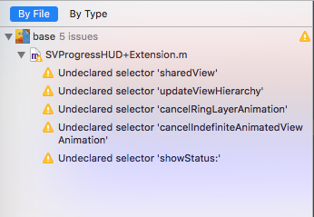
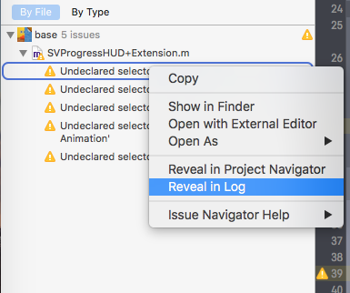
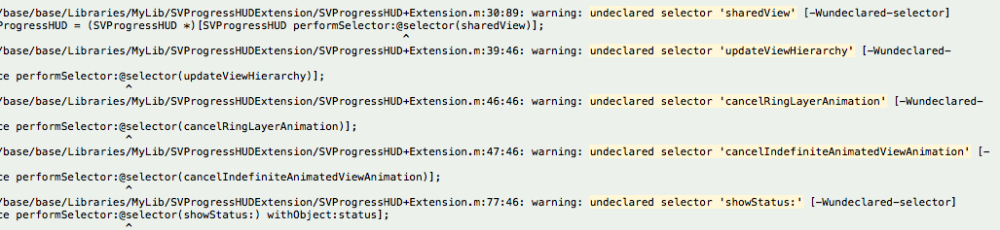
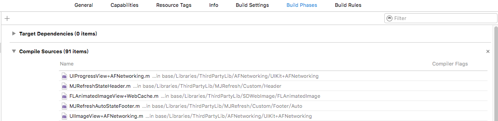

#  App开发流程之忽略编译警告

### 2016-10-13 14:56

## 忽略代码片段中的编译警告

使用performSelector方法时候，当前类中未找到的方法名，会被提示“Undeclared selector”的警告。

但是如果确定分类中存在指定名称的方法，可以忽略编译警告。

```
#pragma clang diagnostic push
#pragma clang diagnostic ignored"-Wundeclared-selector"
    //写在该范围内的代码,都不会被编译器提示上述类型的警告
#pragma clang diagnostic pop
```

使用上述代码，可以忽略代码片段中指定类型（-Wundeclared-selector）的编译警告。

同理，也可以用于忽略其他类型的编译警告。

### 关键问题

如何获取编译警告的类型Flag，例如-Wundeclared-selector。

先注释上述控制代码，即出现编译警告如下图：



然后右键其中一个警告，选择：Reveal In Log：



在All Issues中，关注如下内容：



其中，[-Wundeclared-selector]就是该警告的类型flag。 

## 忽略指定文件的编译警告

找出警告类型如上，然后将flag内容修改为类似：-Wno-undeclared-selector，添加到下图中Compiler Flags中：



这步骤与添加“-fno-objc-arc”的非ARC编译flag一样。


## 忽略整个工程（Target）的编译警告

在上图的Build Settings栏下，找到Other Warning Flags项：


将之前步骤中找到的警告类型flag，加入Other Warning Flags的值中。

## 自定义warning

在编码过程中，如果需要增加自定义warning的代码，可以用于提示自己或者同事：

```
#warning This is a custom warning
```