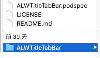
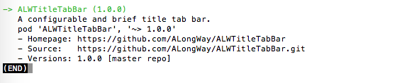

# 使自己的项目支持CocoaPods管理

### 2017-02-16 17:59

该篇记录使自己的项目支持CocoaPods管理。

要达到这一目的，需要如下步骤：

1. 将自己的项目提交到github，添加开源协议license
2. 添加podspec文件
3. 验证podspec，成功后提交到github
4. 注册CocoaPods的trunk账号
5. 将podspec文件提交到trunk

接下来，以我的一个开源组件[ALWTitleTabBar](https://github.com/ALongWay/ALWTitleTabBar)为例，逐步记录。

## 将自己的项目提交到github，添加开源协议license

该步骤的操作，如果有不清楚的，可参考我之前的git使用介绍的文章。

## 添加podspec文件

该步骤是核心操作。

使用终端cd到与类库根目录同级的目录。使用```vim xxx.podspec```指令创建podspec文件后，应该类似如下文件结构：



ALWTitleTabBar目录下仅有类库资源及文件。

如果还想提供demo，在这个同级目录下创建demo的专用文件夹即可。但不建议加入CocoaPods管理。

 

### 创建podspec文件

在终端依次输入：

```
pod spec create ALWTitleTabBar

vi ALWTitleTabBar.podspec
```

即可创建成功并进入编辑状态(或者直接一步到位，输入：```vim ALWTitleTabBar.podspec```)

 

编辑podspec文件是最重要也稍微麻烦的操作，因为该文件需要配置一系列参数，然后才能使类库发布的各个版本被正确依赖使用。

完整的配置说明，可查阅：[podspec的配置指南](https://guides.cocoapods.org/syntax/podspec.html#specification)

在此，只展示使用的部分：

```
Pod::Spec.new do |s|
s.name         = 'ALWTitleTabBar'
s.version      = '1.0.0'
s.license      = { :type => 'MIT' }
s.homepage     = 'https://github.com/ALongWay/ALWTitleTabBar'
s.authors      = { 'ALongWay' => '370381830@qq.com' }
s.platform     = :ios, '7.0'
s.summary      = 'A configurable and brief title tab bar.'
s.source       = { :git => 'https://github.com/ALongWay/ALWTitleTabBar.git', :tag => '1.0.0' }
s.source_files = 'ALWTitleTabBar/**/*.{h,m}'
s.frameworks   = 'UIKit', 'Foundation'
end
```

大多配置都可以自说明，特别注意```source_files```参数，value内容的ALWTitleTabBar指的就是与podspec文件同级的文件夹。

然后点击ESC键，在终端输入：

```:wq```

就可以保存退出了。

## 验证podspec，成功后提交到github

编辑完成后，需要编译类库和验证podspec文件。

输入：

```pod lib lint ALWTitleTabBar.podspec```

等待验证结果，如果失败了，需要一直修改到验证通过。

在这个示例组件中，如果将ALWTitleTabBarConfiguration.h中的UIKit引用移动到ALWTitleTabBar，重新验证，将提示前者中的UIColor等类型无效。

如果验证通过，就可以将podspec文件提交到github了。

### 注意tag的提交

因为podspec文件中有对应的version，所以要保证github上希望被依赖的类库版本号，即用tag标记的发布版本号，与当前即将发布的podspec文件的version一致。

这个tag可以在github的该项目首页——》release栏里去设置，也可以在终端或者客户端提交时候设置。

## 注册CocoaPods的trunk账号

上一步已经验证好了podspec，最终需要发布到CocoaPods的trunk中，才能被搜索到和依赖使用。

### 注册trunk号

如果没有注册过trunk账号，需要先注册，在终端输入：

```pod trunk register 370381830@qq.com ALongWay```

也就是注册邮箱和用户名

注册成功后，可以查看信息，输入：

```pod trunk me```

当然，trunk还有其他指令，可以输入```pod trunk --help```查看更多。

## 将podspec文件提交到trunk

最后一步了。

保证cd到podspec文件所在目录，在终端输入：

```pod trunk push```

应该是可以等到成功的提示。

至此，已经使自己的项目支持了CocoaPods管理。

## 搜索pod库

在终端输入：

```pod search ALWTitleTabBar```

可以看到如下输出：



补充一点：

搜索完成以后，需要退出，先点击ESC键，之后不管显不显示内容，直接输入：

```:wq```

则自动退出。