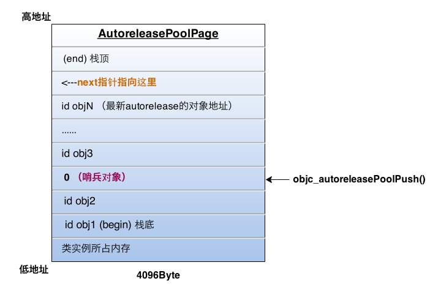
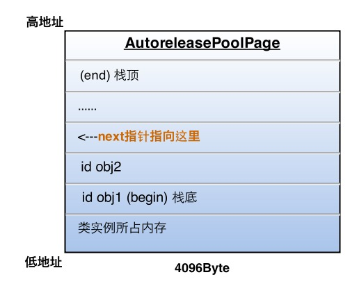

# iOS内存管理概述

## 思维导图


## 一、内存

### 1. 概念

内存是什么？

冯·诺依曼结构，也称做普林斯顿结构：计算机由运算器、控制器、存储器、输入和输出设备几大部件组成。运算器和控制器都合在一起，就是CPU，中央处理器。那么内存就是CPU能直接读写访问数据的地方。

内存，简单来说就是内部存储器。

内存是用来存啥的呢？指令+数据！

指令基本就是代码逻辑，数据包括变量常量等。

### 2. 虚拟内存

虚拟内存从何而来？

物理内存不大，但是要承载操作系统，还要跑多个程序，接受消耗很大内存的程序，怎么办？提出虚拟内存的概念。

虚拟内存是计算机系统内存管理的一种技术。它使得应用程序认为它拥有连续的可用的内存（一个连续完整的地址空间），而实际上，它通常是被分隔成多个物理内存碎片，还有部分暂时存储在外部磁盘存储器上，在需要时进行数据交换。

Windows的虚拟内存在硬盘上的存在形式就是PAGEFILE.SYS这个页面文件。

首先，操作系统层面做了物理内存地址和虚拟内存地址（程序逻辑地址）之间的映射转换。一个程序在运行时，实际要用到的指令和数据都是很有限的，只要有条理的把暂时要用到的部分放进物理内存供CPU访问就可以了。

在三级存储体系中，cache和主存构成了系统的内存，而主存和辅存依靠辅助软硬件的支持构成了虚拟存储器。

### 3. 内存交换

怎么交换？

当进程使用的内存超过物理内存大小时，操作系统会将一部分暂时用不到的内存写入磁盘的交换文件，以腾出空间；当需要使用时，又会将交换文件中所需的部分读取到物理内存中。

### 4. 内存分页

如何分页？

iOS 把虚拟内存每 4KB 划分成一个 Page，并不是所有的 Page 都会映射到物理内存中。每个 Page 有三种状态：

1. **Nonresident**：当前Page未被映射到物理内存中
2. **Resident and clean**：基于 readonly 文件而被加载到内存中的 Page 称为 clean memory，比如：系统 framework、可执行文件、通过 mmap 方式读取的文件等。这种 Page 由于是加载自不可变的文件，因此可以在物理内存紧张时被 iOS 自动 unload 出去，并且在需要的时候再重新从原来的文件加载到内存中。
3. **Resident and dirty**：比如通过 alloc 在堆上创建的内存空间，已经解压的图片，database caches等。dirty memory 不能被操作系统交换出去，只有在进程被杀死的时候才能被回收，因此在系统发生内存告警时，如果进程创建了大量的 dirty memory，那么将很有可能被 kill 掉。

**举例：**

* Malloc分配内存：

``char *p = malloc(2 * 4096);``

此时会在虚拟内存里申请两份 4096 字节的内存，但由于申请后没有使用，操作系统不会真正为刚申请的内存空间分配对应的物理内存空间，因此此时该内存空间处于 Nonresident 状态。如果对 p[0] 赋值：

``p[0] = 1;``

此时 P[0] 会被加载到物理内存上，由此变成 Resident dirty 状态。

* mmap 加载文件

mmap是一种内存映射文件的方法，即将一个文件或者其他对象映射到进程的地址空间，实现文件磁盘地址和进程虚拟地址空间一段虚拟地址的一一对应关系。

```
NSData *data = [NSData dataWithContentsOfMappedFile:file];
char *p = (char *)[data bytes];
```

此时文件由于未被使用，因此也仅仅是在虚拟内存中，操作系统并没有将其映射到物理里，因此所属 Page 的状态是 Nonresident。如果调用以下代码：

``printf("%c", p[0]);``

此时由于该文件的 p[0] 部分被使用，操作系统就会将 p[0] 部分加载到物理内存中，又因为 p 对应的存储区域是一个 mmap 方式加载的只读文件，因此 p[0] 对应的 Page 就是 Resident clean 的，而 p[1] 往后的部分由于仍然未被使用，Page 的状态不变。

mmap机制特点和优势：

1. 操作mmap映射的逻辑内存就是相当于操作文件
2. 操作速度快，可以用mmap来做数据缓存
3. mmap将数据回写到文件的时机交给操作系统控件，例如进程退出的时候会自动回写文件
4. mmap对文件的读写操作不需要页缓存，只需要从磁盘到用户主存的一次数据拷贝过程，减少了数据拷贝次数，提高了文件读写效率

**建议：**

1. 该尽可能减少 dirty 内存的创建
2. 要尽量保证 dirty 内存用完之后及时释放

### 5. 存储区域

内存的储存区域分布是什么样的？


* 栈区：

栈是向低地址扩展的数据结构，是一块连续的内存区域。栈顶的地址和栈的最大容量是系统预先规定好的。栈的空间很小，大概1-2M，超出则overflow。

函数(方法)运行时向系统请求的内存。栈中的局部变量、参数由编译器分配和释放，函数运行就分配，函数结束就释放，由系统完成。

* 堆区：

堆是向高地址扩展的数据结构，不连续的内存区域。系统用链表储存空闲地址的，链表遍历由低向高。堆大小直接受设备有效虚拟内存影响。

用于存放实例对象，由开发者分配和释放(arc自动插入分配和释放代码)，例如alloc申请的内存空间在堆中。

1. 操作系统有一个记录空闲内存地址的链表
2. 当系统收到程序的申请时，会遍历该链表，寻找第一个空间大于所申请空间的堆结点，然后将该结点从空闲结点链表中删除，并将该结点的空间分配给程序
3. 由于找到的堆结点的大小不一定正好等于申请的大小，系统会自动的将多余的那部分重新放入空闲链表中

* 全局/静态区：

静态变量和全局变量是存储在一起的。初始化的全局变量和静态变量存放在一块区域，未初始化的全局变量和静态变量在相邻的另一块区域，程序结束后有系统释放。

* 常量区：

存放常量字符串，程序结束系统释放

* 代码区：

存放函数的二进制代码

**注意：**

1. 在iOS中，堆区的内存是应用程序共享的，堆中的内存分配是系统负责的
2. 当一个app启动后，代码区，常量区，全局区/静态区大小已固定，因此指向这些区的指针不会产生崩溃性的错误
3. 堆区和栈区是时时刻刻变化的（堆的创建销毁，栈的弹入弹出），所以当使用一个指针指向这两个区里面的内存时，一定要注意内存是否已经被释放，否则会产生程序崩溃（也即是野指针报错）。

### 6. 指针究竟是什么？

指针（pointer）和 int，char 类似，是一种独立的数据类型。区别在于，当我们说“指针”时，其实是说一系列的数据类型（泛指），就像我们说“数值型数据类型”，也是泛指（包括  int, float, double 等等）。当我们具体说 “int 型指针”时，我们是说 `int*`（而不是 `float*` 或者 `double*`），就像是指出了数值类型中的某一个具体类型（例如 int）。

指针是用来保存地址的。

### 7. iOS内存特点

1. 物理内存较少
2. 低内存通知
3. 没有内存交换机制。桌面操作系统可以在物理内存紧张的时候把暂时不用的物理内存置换到磁盘上，并在需要的时候再次加载到内存中。而 iOS 没有这种机制，原因是移动设备的闪存没有 PC 机那么大的硬盘，而且频繁的读写闪存会降低其寿命。目前 iOS 在内存不足时采用的方案是杀死优先级较低的进程。
4. 使用虚拟内存机制


## 二、GNUStep

为啥要提到GNUStep？

开源软件[GNUStep](http://gnustep.org)是Cocoa框架的互换框架，实现非常相似。故函数的内部实现均可参考GNUStep源码。再结合[objc4库](http:www.opensource.apple.com/source/objc4)分析函数内部实现。


## 三、iOS内存管理方式和生命周期是什么样的？

### 1. 实例化一个对象的过程在干嘛？

#### alloc

函数调用关系：alloc -> allocWithZone -> NSAllocateObject -> NSZoneMalloc/memset/(struct obj_layout)

说明：

1. **NSZone是防止内存碎片化而引入的结构，对内存分配的区域本身进行多重化管理，根据使用对象的目的、对象的大小分配内存，从而提高了内存管理的效率。**在NSObject这个类的官方文档里面，allocWithZone方法介绍说，该方法的参数是被忽略的，正确的做法是传nil或者NULL参数给它。而这个方法之所以存在，是历史遗留原因。
2. NSAllocateObject函数内部计算容纳对象所需内存大小，最后返回对象指针
3. NSZoneMalloc申请内存空间
4. memset函数将内存空间置为0
5. struct obj_layout中的retained整数用于保存引用计数，并将其写入对象内存头部（苹果是实现，是保存在引用计数表的记录中）

思考：

1. 调用alloc后内存是直接映射到堆还是只分配给了虚拟内存？可使用Instruments的Allocations查看Persistent Bytes(堆)。
2. 分配的内存到底是多大？

自定义DYModel对象，添加头文件引用:

```
#import <objc/runtime.h>
#import <malloc/malloc.h>
```

示例代码如下：

```
DYModel *model = [DYModel alloc];
NSLog(@"Size of %@: %zd", NSStringFromClass([DYModel class]), malloc_size((__bridge const void *) model));
```

```
2018-02-08 19:32:19.196267+0800 DYMemoryDemo[65305:12273538] Size of DYModel: 16
```

为DYModel添加两个属性：

```
@property (nonatomic, assign) int count;
@property (nonatomic, strong) NSString *name;
```

```
2018-02-08 19:41:45.340711+0800 DYMemoryDemo[65895:12321930] Size of DYModel: 32
```

为何会有上面的输出结果？

请先看一张数据类型占用内存表：


三点前提：

1. 任何对象都有一个isa指针，需要分配内存
2. 32位机子上指针大小为4字节，64位机子为8字节
3. 字节对齐

第一次计算：

1. 第一个示例(对象只有一个isa指针)，64位操作系统上应该是8，然而输出是16。
2. 第二个示例(对象有一个int，一个NSString指针，一个isa指针)，64位操作系统上应该是4+8+8=20，然而输出是32。

字节对齐：

苹果文档说明：当分配一块内存的时候，如果需要的内存小于16个字节，操作系统会直接分配16个字节；如果需要的内存大于16个字节，操作系统会分配`a*16`个字节（`a*16` >= 所需内存，a为最小值）。

#### init

初始化对象，包括设置成员变量初始值这些工作。

#### new

内部实现代码，使用alloc和init。从SmallTalk语言而来，历史遗留。目前作用是一致的。

### 2. 什么是引用计数机制？

OC对象中存有引用计数这一整数值（retainCount），对引用采用计数方式，生成和持有对象，则计数+1，释放对象计数-1，当对象的引用计数为0时，则废弃对象。OC中的这种内存管理，也就是引用计数。

思考方式为：

1. 自己生成的对象，自己持有。
2. 非自己生成的对象，自己也能持有。
3. 不再需要自己持有的对象时释放。
4. 非自己持有的对象无法释放。

MRC(手动引用计数)时，对象操作与OC方法的对应关系为：

1. 生成并持有对象，对应alloc/new/copy/mutableCopy等方法。
2. 持有对象，对应retain方法。例如使用[NSMutableArray array]，取得非自己生成的对象，需要调用retain来持有对象。
3. 释放对象，对应release方法。
4. 废弃对象，对应dealloc方法。

引用计数表：

1. 通过对[objc4库](http:www.opensource.apple.com/source/objc4)和Core Foundation框架源代码中CFRuntime.c的__CFDoExternRefOperation函数分析，可以得出苹果使用了散列表（引用计数表）来管理引用计数。
2. 散列表（Hash table，也叫哈希表），是根据键值对(Key value)而直接进行访问的数据结构。也就是说，它通过把键值对映射到表中一个位置来访问记录，以加快查找的速度。这个映射函数叫做散列函数，存放记录的数组叫做散列表。
3. 表键值为内存块地址的散列值

引用计数表优势：

1. 给对象分配的内存块无需考虑内存块头部
2. 引用计数表各记录中存有的内存块地址，可以追溯到各对象的内存块

### 3. 什么是自动引用计数？

ARC就是指内存管理中对引用采取自动计数的技术。让编译器进行内存管理，无需再次输入retain或者release。

### 4. autorelease原理如何？

* autorelease的实现：

本质就是调用了NSAutoreleasePool对象的addObject类方法，将当前实例对象加入正在使用的NSAutoreleasePool对象。

* ARC下的autorelease

先看C语言中的自动变量。

C语言程序执行时，若某自动变量超出其作用域，该自动变量将被自动废弃。

@autoreleasepool{}会像C语言的自动变量那样来对待实例对象。当超出实例对象作用域后，autoreleasepool被废弃，实例对象的release实例方法将被调用。

* MRC下的autorelease使用方法如下：

1. 生成并持有NSAutoreleasePool对象
2. 调用已分配对象的autorelease实例方法。
3. 废弃NSAutoreleasePool对象。调用其drain实例方法，等同于调用了其中的对象的release方法。


### 5. NSAutoreleasePool生命周期是怎样的？

1. NSRunLoop每次循环过程中，其管理的NSAutoreleasePool对象被生成或废弃。
2. 在适当地方，可以主动生成、持有或废弃NSAutoreleasePool对象。

### 6. NSRunLoop是啥？

NSRunLoop是iOS消息机制的处理模式，控制对应线程的执行和休眠，在有事情做的时候使当前NSRunLoop控制的线程工作，没有事情做的时候让当前NSRunLoop控制的线程休眠。

如果说整个工厂是一个进程，工厂里面的线程是生产线，那么runloop就是守着这些生产线的工人。

* 官方配图：


NSRunLoop一直在循环检测，从线程start到线程end，检测input sources、timer sources，当检测到输入源则会执行处理函数。

* RunLoop消息类型（事件源）：

1. Port:监听程序的Mach ports，Mach ports是一个比较底层的东西，可以简单的理解为：内核通过port这种方式将信息发送，而mach则监听内核发来的port信息，然后将其整理，打包发给runloop。
2. Custom:开发人员自己发送。如点击，双击等操作。
3. Selector Sources:NSObject类提供了很多方法供我们使用，这些方法是添加到runloop的，所以如果没有开启runloop的话，不会运行。特殊：如果调用线程和指定线程为同一线程，且wait参数设为YES，那么aSelector会直接在指定线程运行，不再添加到runloop；没有延迟或者等待的都不会添加到runloop。
4. Timer sources:定时器事件，且消息发送是同步的。

* RunLoop模式：

系统为我们提供了多种模式，常见类型如下：

1. kCFRunLoopDefaultMode（NSDefaultRunLoopMode）: App的默认 Mode，通常主线程是在这个 Mode 下运行的。
2. UITrackingRunLoopMode: 界面跟踪 Mode，用于 ScrollView 追踪触摸滑动，保证界面滑动时不受其他 Mode 影响。
3. UIInitializationRunLoopMode: 在刚启动 App 时第进入的第一个 Mode，启动完成后就不再使用。
4. NSRunLoopCommonModes: 包含了多种模式，例如default和tracking mode。

除了系统提供的模式，我们也可以自定义。

上面提到的事件源，都是处于特定的模式下的，如果和当前runloop的模式不一致则不会得到响应。假设定时器处于mode1，而runloop运行在mode2，则定时器不会触发，只有runloop运行在mode1时，定时器才会触发。

* RunLoop生命周期：

1. 苹果不允许开发人员手动创建runloop
2. 主线程中runloop是由系统创建且自动运行
3. 非主线程中runloop是只能当开发者在当前线程主动调用`[NSRunLoop currentRunLoop]`方法来获取runloop的时候，才由系统懒加载创建
4. 非主线程runloop需要开发者主动调用run系列方法才能运行
5. 非主线程runloop运行后，如果runloop所在的模式没有对应的事件源，即上面提到的input sources、timer sources，会直接退出当前runloop
6. 到达设置的退出时间也会导致runloop退出。例如使用该方法运行runloop```- (void)runUntilDate:(NSDate *)limitDate;```
7. 使用CFRunLoopStop函数也可以强制runloop退出
8. 线程与runloop是一一对应的，具有唯一性

* RunLoop与线程关系图：


* RunLoop运行期间内部执行流程：


1. 第1步的观察者，会创建自动释放池
2. 第6步的观察者，会销毁老的自动释放池，并创建新的自动释放池，对于一个runloop来说，此步骤会不断的循环
3. 第10步的观察者，销毁自动释放池
4. runloop是否退出与observe没有关系，observe只是监听runloop本身的状态而已

### 7. NSAutoreleasePool内部到底是怎么运行的？

objc4库的runtime/objc-arr.mm文件中有定义函数：

```
void *objc_autoreleasePoolPush(void)
{
    return AutoreleasePoolPage::push();
}

void objc_autoreleasePoolPop(void *ctxt)
{
    AutoreleasePoolPage::pop(ctxt);
}
```

ARC下，我们使用@autoreleasepool{}来使用一个AutoreleasePool，随后编译器将其改写成下面的样子：

```
void *context = objc_autoreleasePoolPush();
// {}中的代码
objc_autoreleasePoolPop(context);
```
 
而这两个函数都是对AutoreleasePoolPage的简单封装，所以自动释放机制的核心就在于这个类。

AutoreleasePoolPage是一个C++实现的类：


1. AutoreleasePool并没有单独的结构，而是由若干个AutoreleasePoolPage以**双向链表**的形式组合而成（分别对应结构中的parent指针和child指针）
2. AutoreleasePool是按线程一一对应的（结构中的thread指针指向当前线程）
3. AutoreleasePoolPage每个对象会开辟4096字节内存（也就是虚拟内存一页的大小），除了上面的实例变量所占空间，剩下的空间全部用来储存autorelease对象的地址
4. 上面的`id *next`指针作为游标指向栈顶最新add进来的autorelease对象的下一个位置
5. 一个AutoreleasePoolPage的空间被占满时，会新建一个AutoreleasePoolPage对象，连接链表，后来的autorelease对象在新的page加入

当前线程中只有一个AutoreleasePoolPage对象，并记录了很多autorelease对象地址时内存如下图：


图中的情况，这一页再加入一个autorelease对象就要满了（也就是next指针马上指向栈顶），这时就要执行上面说的操作，建立下一页page对象，与这一页链表连接完成后，新page的next指针被初始化在栈底（begin的位置），然后继续向栈顶添加新对象。

所以，向一个对象发送`- autorelease`消息，就是将这个对象加入到当前AutoreleasePoolPage的栈顶next指针指向的位置。

* 对AutoreleasePoolPage操作流程

每当进行一次`objc_autoreleasePoolPush`调用时，runtime向当前的AutoreleasePoolPage中add进一个**哨兵对象**，值为0（也就是个nil），那么这一个page就变成了下面的样子：



`objc_autoreleasePoolPush`的返回值正是这个哨兵对象的地址，被`objc_autoreleasePoolPop(哨兵对象)`作为入参，于是：

1. 根据传入的哨兵对象地址找到哨兵对象所处的page
2. 在当前page中，将晚于哨兵对象插入的所有autorelease对象都发送一次`- release`消息，并向回移动next指针到正确位置
3. 从最新加入的对象一直向前清理，可以向前跨越若干个page，直到哨兵所在的page

刚才的`objc_autoreleasePoolPop`执行后，最终变成了下面的样子：



### 8. 有返回值的函数中return跟autoreleasePool有什么关系？

ARC下，runtime有一套对autorelease返回值的优化策略。比如一个工厂方法：

```
+ (instancetype)createCar {
    return [self new];
}

// caller
Car *car = [Car createCar];
```
编译器改写成了形如下面的代码：

```
+ (instancetype) createCar {
    id tmp = [self new];
    return objc_autoreleaseReturnValue(tmp); // 代替我们调用autorelease
}

// caller
id tmp = objc_retainAutoreleasedReturnValue([Car createCar]) // 代替我们调用retain
Car *car = tmp;
objc_release(tmp);
```

返回注册到autoreleasepool中对象的方法，使用了objc_autoreleaseReturnValue函数，但是该函数与objc_autorelease函数不同，一般不仅限于注册对象到autoreleasepool中。

该函数会检查使用该函数的方法或函数调用方的执行命令列表，如果方法或函数的调用方在之后紧接着调用objc_retainAutoreleasedReturnValue()函数，那么就不将返回的对象注册到autoreleasepool中，而是直接传递到方案或函数的调用方。这一过程达到了最优化。

### 9. 容器的block版本的枚举器autoreleasePool有什么关系？

使用容器的block版本的枚举器时，内部会自动添加一个AutoreleasePool：

```
[array enumerateObjectsUsingBlock:^(id obj, NSUInteger idx, BOOL *stop) {
    // 这里被一个局部@autoreleasepool包围着
}];
```
在普通for循环和for in循环中没有添加，当for循环中遍历产生大量autorelease变量时，如果需要及时释放，就要自己加入局部AutoreleasePool。

## 四、属性和变量的修饰符有哪些作用？

### 1. 属性特征修饰符有哪些？

常见修饰符有：

1. atomic、nonatomic：指定合成存取方法是否为原子操作，可以理解为是否线程安全。常使用nonatomic，避免iOS中开销较大的锁机制，提高访问性能。
2. readwrite、readonly：readwrite是编译器的默认选项
3. assign：表示对属性只进行简单的赋值操作，不更改引用计数，常用于标量类型，如NSInteger，NSUInteger，CGFloat，NSTimeInterval等。也可以修饰对象，如NSString等类型对象，但是当对象被销毁时，编译器不会将该属性置为nil，指针仍旧指向之前被销毁的内存，这时访问该属性会产生野指针错误并崩溃，因此使用assign修饰的类型一定要为标量类型。
4. unsafe_unretained：同assign类似，只是不能修饰对象。
5. weak：只能修饰对象。弱引用对象，即不更改对象的引用计数，但当对象被销毁时，修饰的属性会被自动赋值为nil，这样就可以避免野指针错误。
6. strong：只能修饰对象。强引用对象，即使对象的引用计数+1。
7. copy：理论上修饰的属性会在内存里拷贝一份对象，两个指针指向不同的内存地址。一般修饰的对象都存在可变类型的子类，
如：NSString/NSMutableString,NSArray/NSMutableArray,NSDictionary/NSMutableDictionary等。但是不同的属性类型，存在不同结果。
8. retain：在ARC环境下使用较少，在MRC下使用效果与strong一致。
9. getter、setter：可用来覆盖编译器默认生成的存取方法

补充：

1. 被copy修饰的NSString类型的属性，并不会在get/set方法调用后，拷贝对象
2. 被copy修饰的NSArray/NSMutableArray、NSDictionary/NSMutableDictionary类型的属性，并不会在get/set方法调用后，拷贝容器对象

### 2. 变量所有权修饰符有哪些？

ARC有效时，所有权修饰符一共有四种：

1. `__strong`：id和对象类型在没有明确指定所有权修饰符时，默认的。修饰的变量在超出作用域时，会释放其被赋予的对象。
2. `__weak`：该修饰符作用与属性的weak修饰符一样。常用用于解决循环引用问题。
3. `__unsafe_unretained`：基本上与`__weak`一样，但是当对象被废弃以后，变量变为悬垂指针，若再次访问，程序将会崩溃。
4. `__autoreleasing`：较少使用，在@autoreleasepool代码块中，将为变量自动添加该修饰符，加入自动释放池。函数返回对象时，编译器也会自动将其注册到autoreleasepool。

### 3. 弱引用是怎么实现的？

Runtime维护了一个weak表，用于存储指向某个对象的所有weak指针。weak表其实是一个哈希表，Key是所指对象的地址，Value是weak指针的地址（指针地址的值也就是所指对象的地址）的数组。

在对象被回收的时候，经过层层调用，会最终触发下面的方法将所有weak指针的值设为nil。(具体定义在objc-weak.m中)：

```
PRIVATE_EXTERN void arr_clear_deallocating(weak_table_t *weak_table, id referent) {
    {
        weak_entry_t *entry = weak_entry_for_referent(weak_table, referent);
        if (entry == NULL) {
            /// XXX shouldn't happen, but does with mismatched CF/objc
            //printf("XXX no entry for clear deallocating %p\n", referent);
            return;
        }
        // zero out references
        for (int i = 0; i < entry->referrers.num_allocated; ++i) {
            id *referrer = entry->referrers.refs[i].referrer;
            if (referrer) {
                if (*referrer == referent) {
                    *referrer = nil;
                }
                else if (*referrer) {
                    _objc_inform("__weak variable @ %p holds %p instead of %p\n", referrer, *referrer, referent);
                }
            }
        }

        weak_entry_remove_no_lock(weak_table, entry);
        weak_table->num_weak_refs--;
    }
}
```

简单来说，这个方法首先根据对象地址获取所有weak指针地址的数组，然后遍历这个数组把其中的数据设为nil，最后把这个entry从weak表中删除。至于Weak指针如何注册到Weak表中、如何维护可以参考objc-weak.m中的其它源码。

## 五、可变/不可变-容器/非容器变量分别是什么？

### 1. 类别

1. 不可变非容器变量：NSString
2. 可变非容器变量：NSMutableString
3. 不可变容器变量：NSArray、NSDictionary
4. 可变容器变量：NSMutableArray、NSMutableDictionary

### 2. 浅拷贝和深拷贝是什么？

1. 浅拷贝：只拷贝指针，不拷贝对象的操作。新的指针仍然指向旧的对象。
2. 深拷贝：即拷贝指针，又拷贝对象的操作。新的指针指向新的对象。

### 3. copy和mutableCopy对以上各类型变量的影响？

type  		| copy 							| mutableCopy
--------- | ---------------------------	| --------------------------
不可变变量	| 浅拷贝，只拷贝指针，地址相同		| 单层深拷贝，拷贝内容，地址不同
可变变量  	| 单层深拷贝，拷贝内容，地址不同	| 单层深拷贝，拷贝内容，地址不同

1. 对于NSString类型的变量，不管使用copy、strong修饰符，还是调用copy实例方法，新的指针指向的对象地址相同
2. 对于容器变量，单层深拷贝，意味着只是实例化了一个新的容器对象，但是容器内的元素指针还是旧的对象地址
3. copy方法，得到的新对象是不可变类型；mutable方法，得到的新对象是可变类型
4. 自定义对象，若想调用copy方法，需要实现NSCopying协议的`- (id)copyWithZone:(NSZone *)zone`方法
5. 自定义对象，若想调用mutableCopy方法，需要实现NSMutableCopying协议的`- (id)mutableCopyWithZone:(NSZone *)zone`方法 

## 六、空指针、悬垂指针和野指针区别？

### 1. 各自的定义是什么？

1. 空指针：没有存储任何内存地址的指针就称为空指针(NULL、nil指针)
2. 悬垂指针（dangling pointer）：一般是说指向已经被释放的自由区内存（free store）的指针。
3. 野指针（wild pointer）：当所指向的对象被释放或者收回，但是对该指针没有作任何的修改，以至于该指针仍旧指向已经回收的内存地址，此情况下该指针便称野指针。（另一种说法：一般是未经初始化的指针。）

### 2. 悬垂指针（野指针）危害

若操作系统将这部分已经释放的内存重新分配给另外一个进程，而原来的程序重新引用现在的悬垂指针（野指针），则将产生无法预料的后果。因为此时悬垂指针（野指针）所指向的内存现在包含的已经完全是不同的数据。通常来说，若原来的程序继续往悬垂指针（野指针）所指向的内存地址写入数据，这些和原来程序不相关的数据将被损坏，进而导致不可预料的程序错误。

### 3. 造成野指针原因

首先内存被释放后不代表内存会立刻被覆写或者数据受到破坏，这时候访问这块内存也不一定会出错。其次，多线程技术带来了复杂的应用运行环境，在这个环境下，未加保护的数据可能是致命的。此外，设计不够严谨的代码同样也是造成野指针异常的重要原因之一。

### 4. 野指针调试

1. Xcode提供了Malloc Scribble对已释放内存进行数据填充，从而保证野指针访问是必然崩溃的。另外，Bugly借鉴这一原理，通过修改free函数，对已释放对象进行非法数据填充，也有效的提高了野指针的崩溃率。但Xcode9的Malloc Scribble启动后已经不会填充对象的内存地址。
2. Zombie Objects是一种完全不同的野指针调试机制，将释放的对象标记为Zombie对象，再次给Zombie对象发送消息时，发生crash并且输出相关的调用信息。这套机制同时定位了发生crash的类对象以及有相对清晰的调用栈。

### 5. 解决方案探讨

1. 可以借鉴Zombie Objects的实现思路去定位野指针异常
2. iOS的消息转发机制让我们可以给对象发送一个未注册的消息，通常这会引发unrecognized selector异常。但是在抛出异常之前，存在一个消息转发机制，允许我们重新指定消息的接收方来处理这个消息。正是这一机制实现了防unrecognized selector crash的可行化

## 七、小实验

### 1. 字符串的引用计数

```
- (void)testMethodA
{
    for (int i = 0; i < 10; i++) {
        NSString *string = @"iOS";
        NSLog(@"address: %p, retainCount: %d", string, [[string valueForKey:@"retainCount"] intValue]);
        
        string = [string stringByAppendingString:@"内存管理"];
        NSLog(@"address: %p, retainCount: %d", string, [[string valueForKey:@"retainCount"] intValue]);
        
        NSString *newStr = [NSString stringWithFormat:@"格式化字符串"];
        NSLog(@"address: %p, retainCount: %d", newStr, [[newStr valueForKey:@"retainCount"] intValue]);
        
        NSString *newStr1 = [[NSString alloc] initWithFormat:@"格式化字符串1"];
        NSLog(@"address: %p, retainCount: %d", newStr1, [[newStr1 valueForKey:@"retainCount"] intValue]);
    }
}
```

```
2018-02-10 11:24:09.911274+0800 DYMemoryDemo[12640:16217911] address: 0x109d260d8, retainCount: -1
2018-02-10 11:24:09.911430+0800 DYMemoryDemo[12640:16217911] address: 0x600000056470, retainCount: 1
2018-02-10 11:24:09.911530+0800 DYMemoryDemo[12640:16217911] address: 0x604000452480, retainCount: 2
2018-02-10 11:24:09.911717+0800 DYMemoryDemo[12640:16217911] address: 0x604000451cd0, retainCount: 1
2018-02-10 11:24:09.911778+0800 DYMemoryDemo[12640:16217911] address: 0x109d260d8, retainCount: -1
2018-02-10 11:24:09.911829+0800 DYMemoryDemo[12640:16217911] address: 0x604000451cd0, retainCount: 1
2018-02-10 11:24:09.911973+0800 DYMemoryDemo[12640:16217911] address: 0x6000000564d0, retainCount: 2
2018-02-10 11:24:09.912046+0800 DYMemoryDemo[12640:16217911] address: 0x604000451be0, retainCount: 1
2018-02-10 11:24:09.912116+0800 DYMemoryDemo[12640:16217911] address: 0x109d260d8, retainCount: -1
2018-02-10 11:24:09.912174+0800 DYMemoryDemo[12640:16217911] address: 0x604000451cd0, retainCount: 1
2018-02-10 11:24:09.912239+0800 DYMemoryDemo[12640:16217911] address: 0x6040004524b0, retainCount: 2
2018-02-10 11:24:09.912291+0800 DYMemoryDemo[12640:16217911] address: 0x604000451d00, retainCount: 1
```

### 2. 内存存储

* 这段代码有什么问题，哪一方面的，怎么优化呢？

```
- (void)testMethodA
{
   for (int i = 0; i < 1000000; i++)
   {
      NSString *str = @"iOS";
      str = [str stringByAppendingString:@"内存管理"];
   }
}
```

* 以下数据和变量都存储在哪一类内存中?

```
int a;
int b = 10;

NSString *name1;
NSString *name2 = @"西门吹雪";

- (void)testMethodB
{
   int c;
   NSString *name3 = @"lisong";
   NSString *name4;
   char d[] = "陆小凤";
   static int e = 0;

   NSString *str = [[NSString alloc] initWithFormat:@"haha"];
}
```

### 3. copy修饰符

```
@property (nonatomic, copy) NSMutableArray *nameArray;
```

```
    NSString *name1 = [NSString stringWithFormat:@"陆小凤"];
    NSString *name2 = [NSString stringWithFormat:@"西门吹雪"];
    NSString *name3 = [NSString stringWithFormat:@"叶孤城"];
    
    NSMutableArray *tempArray = [[NSMutableArray alloc] initWithObjects:name1, name2, name3, nil];
    NSLog(@"address: %p", tempArray);

    _nameArray = tempArray;
    NSLog(@"address: %p", _nameArray);

    NSArray *newNameArray = _nameArray;
    NSLog(@"address: %p", newNameArray);
```

```
2018-02-10 18:40:04.225344+0800 DYMemoryDemo[51184:17880963] address: 0x600000247c20
2018-02-10 18:40:04.225488+0800 DYMemoryDemo[51184:17880963] address: 0x600000247c20
2018-02-10 18:40:04.225593+0800 DYMemoryDemo[51184:17880963] address: 0x600000247c20
```

修改部分代码如下：

```
    NSMutableArray *tempArray = [[NSMutableArray alloc] initWithObjects:name1, name2, name3, nil];
    NSLog(@"address: %p", tempArray);

    _nameArray = [tempArray mutableCopy];
    NSLog(@"address: %p", _nameArray);

    NSArray *newNameArray = [_nameArray copy];
    NSLog(@"address: %p", newNameArray);
```

```
2018-02-10 18:42:50.683701+0800 DYMemoryDemo[51377:17896259] address: 0x600000240300
2018-02-10 18:42:50.683819+0800 DYMemoryDemo[51377:17896259] address: 0x600000241920
2018-02-10 18:42:50.683892+0800 DYMemoryDemo[51377:17896259] address: 0x6000002403c0
```

### 4. 野指针

* 一个UIView类型对象的实例方法

```
- (void)didClickedCloseButton
{
    [self removeFromSuperview];

    //__weak typeof(self) weakSelf = self;
    __unsafe_unretained typeof(self) weakSelf = self;
    dispatch_after(dispatch_time(DISPATCH_TIME_NOW, (int64_t)(2 * NSEC_PER_SEC)), dispatch_get_main_queue(), ^{
        [weakSelf testMethod];
    });
}

- (void)testMethod
{

}
```
```
2018-02-10 11:54:36.303860+0800 DYMemoryDemo[14767:16395556] *** -[DYAlertView testMethod]: message sent to deallocated instance 0x7ffc9ed0c540

```

### 5. 通知中心观察者引用实现

iOS8及以前，NSNotificationCenter持有的是观察者的`__unsafe_unretained `指针（可能是为了兼容老版本），这样，在观察者回收的时候未removeOberser，而后再进行post操作，则会向一段被回收的区域发送消息，所以出现野指针crash。而iOS9以后，`__unsafe_unretained`改成了weak指针，即使dealloc的时候未removeOberser，再进行post操作，则会向nil发送消息，所以没有任何问题。

## 八、附录

推荐资料：

1. [alloc、init你弄懂50%了吗？](http://www.cocoachina.com/ios/20160627/16823.html)
2. [黑幕背后的Autorelease](http://blog.sunnyxx.com/2014/10/15/behind-autorelease/)
3. [iOS内存探秘](http://www.cocoachina.com/ios/20170216/18689.html)
4. [NSRunLoop原理详解](https://www.jianshu.com/p/4263188ed940)
5. [iOS监控-野指针定位](https://www.jianshu.com/p/4c8a68bd066c)